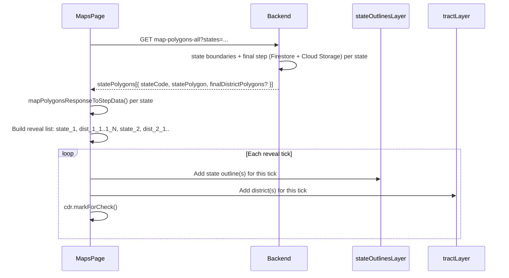

# All-states: Fetch final-step geodistricts and animate state-then-districts

## Current behavior

- **Data:** [loadUSMapDistricts()](frontend/src/app/pages/maps-page.component.ts) calls `getMapPolygonsAll(orderedStateCodes)` → `GET /api/algorithm/map-polygons-all`, which returns only **step 0 (state boundary)** per state ([backend](backend/index.js) lines 3991–4015).
- **Rendering:** Each state is converted to stepData with a single “district” (the state outline) via [mapPolygonsResponseToStepData()](frontend/src/app/pages/maps-page.component.ts) with `hasFinalStep: false`.
- **Animation:** A timer reveals 51 states one-by-one over 5s by calling [renderUSMapDistricts(visible)](frontend/src/app/pages/maps-page.component.ts) with an increasing slice of states; everything is drawn on `tractLayer`. `stateOutlinesLayer` exists but is only cleared, never drawn to.

The per-state endpoint `GET /api/algorithm/map-polygons/:state` already returns both `statePolygon` and `finalDistrictPolygons` (when a final step with union polygons is cached); the frontend already converts that via `mapPolygonsResponseToStepData()` for single-state view.

## Goal

1. When loading All states, for each state fetch **step 0 union polygon** and **final-step geodistrict polygons** when available.
2. Animate: for each state, draw the **state polygon first**, then draw **each geodistrict** on the stage (state outline then districts, in order).

## Data loading strategy

**Option A – Extend backend `map-polygons-all` (recommended)**  

- Change `GET /api/algorithm/map-polygons-all` to return, per state, the same shape as `map-polygons/:state`: `statePolygon` plus optional `finalDistrictPolygons` (and `hasFinalStep`). Reuse the existing logic from [map-polygons/:state](backend/index.js) (Firestore final-step lookup + Cloud Storage union polygon reads) per state, in parallel (e.g. `Promise.all(stateCodes.map(...))`). One HTTP request; backend does 51× (state boundary + optional final-step load).

**Option B – Frontend-only**  

- Keep `getMapPolygonsAll()` for step 0 only. After it returns, call `getMapPolygons(state)` for each state (in display order, optionally with limited concurrency) and merge `finalDistrictPolygons` into that state’s stepData. No backend change; 1 + 51 HTTP requests and higher latency.

Recommendation: **Option A** for fewer round-trips and a single loading phase; implement Option B only if backend load is a concern.

## Frontend types and service

- **Types:** Extend [MapPolygonsAllResponse](frontend/src/app/services/geodistrict-algorithm.service.ts) so each entry is `{ stateCode, statePolygon, finalDistrictPolygons?: GeoJsonFeature[], hasFinalStep?: boolean }` (aligned with `MapPolygonsResponse`).
- **Service:** `getMapPolygonsAll()` stays as-is; only the backend response shape and the frontend type/usage change. No new service method required if Option A is used.

## Building per-state stepData for All states

- For each state in the response, call the existing **mapPolygonsResponseToStepData()** with `{ statePolygon, finalDistrictPolygons, hasFinalStep }`. That already produces:
  - If `finalDistrictPolygons?.length`: one district group per final district (with `unionPolygon` / `unionPolygons`).
  - Else: one district group with the state polygon (step 0 only).
- Use this to set `usMapStepDataByState` and recompute `usMapTotalDistricts` (and any caches) from the new stepData.

## Animation: state outline first, then each geodistrict

- **Reveal sequence:** For each state (in display order), the sequence is: **1 frame for the state polygon**, then **one frame per geodistrict** (final districts when present; otherwise the state outline is the only “district” and there is only one frame).
- **Total frames:** Sum over states of `1 + (districtGroups.length || 0)`, where the first 1 is the state outline. Example: CA has 52 districts → 1 (state) + 52 (districts) = 53 frames for CA.
- **Rendering two layers:** Use **stateOutlinesLayer** for state boundaries and **tractLayer** for geodistricts so state borders remain visible under the districts:
  - **stateOutlinesLayer:** When a “state” frame is revealed, draw that state’s boundary (stroke-only or light fill) on `stateOutlinesLayer`.
  - **tractLayer:** When a “district” frame is revealed, draw that district’s polygon(s) on `tractLayer` (existing style: color, fillOpacity, popup, click → `selectStateFromDistrict`).
- **Frame list:** Build a flat list of “reveal items” before starting the timer, e.g. `Array<{ stateCode, type: 'state' | 'district', districtIndex?: number, stateOutline?: GeoJsonFeature, district?: DistrictGroup }>`. Each state contributes one `type: 'state'` item (with `stateOutline`) then N `type: 'district'` items (with `district` and optional `districtIndex`). Single-district states still contribute one state frame; if they have no final step, the single “district” can be the state outline (so state + 1 district = 2 frames, or keep 1 frame if you prefer to treat state-only as one frame).
- **Timer:** Replace the current `take(51)` timer with a timer over the length of this frame list. Interval can remain derived from a total duration (e.g. keep ~5s for the state-outline phase and add extra time for district phase, or use a fixed total duration and divide by total frame count). At each tick, render from frame 0 to current index: clear and redraw only if needed, or incrementally add the new layer(s) for the current frame to avoid full redraws (incremental is better for performance).
- **Render helper:** Add or refactor a method that, given “reveal items 0..K”, draws the corresponding state outlines on `stateOutlinesLayer` and district polygons on `tractLayer` (reusing existing styling and popup/click logic from [renderUSMapDistricts](frontend/src/app/pages/maps-page.component.ts)). Ensure layer order: state outlines below districts (already the case if `stateOutlinesLayer` is added before `tractLayer` in the map).

## Single-district states

- Single-district states (no algorithm run) can continue to have stepData with a single group (state outline). They still get one “state” frame and one “district” frame (same geometry) or a single combined frame; keep behavior consistent with the rest (e.g. one state frame + one district frame so the sequence shape is uniform).

## Files to touch

| Area           | File                                                                                                                     | Changes                                                                                                                                                                                                                                                                                                                                                                                                                                                                                                        |
| -------------- | ------------------------------------------------------------------------------------------------------------------------ | -------------------------------------------------------------------------------------------------------------------------------------------------------------------------------------------------------------------------------------------------------------------------------------------------------------------------------------------------------------------------------------------------------------------------------------------------------------------------------------------------------------- |
| Backend        | [backend/index.js](backend/index.js)                                                                                     | Extend `GET /api/algorithm/map-polygons-all` to load final step (Firestore + Cloud Storage) per state and return `statePolygon` + `finalDistrictPolygons` (and optional `hasFinalStep`) per state. Reuse logic from existing `map-polygons/:state` handler.                                                                                                                                                                                                                                                    |
| Frontend types | [frontend/src/app/services/geodistrict-algorithm.service.ts](frontend/src/app/services/geodistrict-algorithm.service.ts) | Extend `MapPolygonsAllResponse` so each element includes `finalDistrictPolygons?` and `hasFinalStep?`.                                                                                                                                                                                                                                                                                                                                                                                                         |
| Maps page      | [frontend/src/app/pages/maps-page.component.ts](frontend/src/app/pages/maps-page.component.ts)                           | In `loadUSMapDistricts()`: (1) Build stepData from new response using `mapPolygonsResponseToStepData()` per state. (2) Build flat “reveal items” list (state then districts per state). (3) Use `stateOutlinesLayer` for state boundaries and `tractLayer` for districts. (4) Replace 51-tick timer with timer over reveal list; at each tick render cumulative state outlines + districts (new or refactored render helper). (5) Update caching (e.g. `cachedUSMapStepDataByState`) when animation completes. |

## Optional: skip state outline when final districts exist

- If desired, when a state has final districts you can draw only the state outline in the “state” frame and then draw districts (so the outline is not duplicated as a district). The current `mapPolygonsResponseToStepData()` already uses either final districts or state outline, not both in the same stepData; the animation can still show “state first, then districts” by having the state frame draw the outline from `statePolygon` and district frames draw from `districtGroups`.

## Mermaid: data and animation flow

