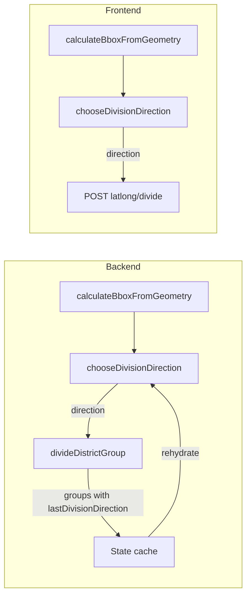

# Bbox aspect ratio division direction

## Goal

Choose division direction per district group from the group's bounding-box aspect ratio (divide perpendicular to the long axis). When aspect ratio is tied or "close", use the parent DG's last division direction to alternate. Remain deterministic and non-interactive.

## Key design decisions

- **Bbox source**: Use geometry-based extent (min/max lat and lng over all tract vertices), not centroid-based bounds, so aspect ratio reflects actual shape. Reuse existing per-tract bounds (e.g. `MIN_LAT`/`MAX_LAT`/`MIN_LNG`/`MAX_LNG` or `getTractBounds`) and aggregate over the group.
- **"Close" threshold**: Treat aspect ratio as tied when `min(latSpan, lngSpan) / max(latSpan, lngSpan) >= 0.9` (or similar). Document the constant in one place so backend and frontend stay in sync.
- **Tie-break**: If tie or close, alternate from parent: if `group.lastDivisionDirection === 'latitude'` then use `'longitude'`, and vice versa; if `null` (initial group) use default `'latitude'`.
- **Persistence**: Add `lastDivisionDirection` to group shape so that when we load state from cache and run "next step", each group carries the direction that was used when that group was created.

## Implementation

### 1. Backend: bbox and direction logic ([backend/services/geodistrict-algorithm.js](backend/services/geodistrict-algorithm.js))

- **Add `calculateBboxFromGeometry(tracts)**`  
Returns `{ north, south, east, west }` from tract geometry extents. For each tract use existing `getTractBounds(tract)` (same file, lines 463–511) to get `minLat, maxLat, minLng, maxLng`; then set `north = max(maxLat)`, `south = min(minLat)`, `east = max(maxLng)`, `west = min(minLng)` over all tracts. Handle empty tract list (e.g. return zeros). Export or keep alongside `calculateBounds` for use by the direction chooser.
- **Add `chooseDivisionDirection(group)**`  
  - Call `calculateBboxFromGeometry(group.censusTracts)` to get bbox.  
  - `latSpan = north - south`, `lngSpan = east - west`.  
  - If both spans are 0 (or negligible), return default `'latitude'`.  
  - Compute ratio: `ratio = min(latSpan, lngSpan) / max(latSpan, lngSpan)` (guard against division by zero).  
  - If `ratio >= CLOSE_ASPECT_THRESHOLD` (e.g. 0.9): treat as tie — use `group.lastDivisionDirection` to alternate (latitude → longitude, longitude → latitude, null → latitude).  
  - Else: if `lngSpan > latSpan` (wider E–W) return `'longitude'`, else return `'latitude'`.  
  - Define `CLOSE_ASPECT_THRESHOLD` as a named constant (e.g. 0.9) at top of file or next to the function.

### 2. Backend: set and use direction in algorithm ([backend/services/geodistrict-algorithm.js](backend/services/geodistrict-algorithm.js), [backend/services/latlong-division.js](backend/services/latlong-division.js))

- **Initial group**  
Where the single initial district group is created (e.g. around 4036–4051), set `lastDivisionDirection: null`.
- **Child groups**  
In [latlong-division.js](backend/services/latlong-division.js), when creating `firstGroup` and `secondGroup` (around 1014–1022), add `lastDivisionDirection: direction` to both objects so children remember how the parent was split.
- **Replace global direction with per-group direction** in all three division sites:
  - **Main loop** (~4094–4112): Instead of `const direction = iteration % 2 === 1 ? 'latitude' : 'longitude'`, inside the `for (const group of currentGroups)` loop, for each group with `totalDistricts > 1` set `const direction = chooseDivisionDirection(group)` and pass that to `divideDistrictGroup(group, direction, ...)`.
  - **executeNextStep** (~1754–1769): Same change — compute `direction = chooseDivisionDirection(group)` per group before calling `divideDistrictGroup`.
  - **Generator (step-by-step)** (~4516–4527): Same change — per-group `direction = chooseDivisionDirection(group)`.
- **Step creation**  
Steps can record the direction that was used for each division; that already comes from the division that created the step. If a step divides multiple groups, `divisionLines[].direction` already stores per-division direction; the step-level `divisionDirection` can remain the first/primary division direction for that step (or be derived from divisionLines). No change strictly required for createStep unless you want step-level `divisionDirection` to reflect a single canonical direction when multiple groups are divided in one step.

### 3. Backend: cache and rehydration ([backend/index.js](backend/index.js))

- **Normalize**  
In `normalizeAlgorithmState`, where `normalizedCurrentGroups` is built (~3381–3399), add `lastDivisionDirection: group.lastDivisionDirection ?? null` to `normalizedGroup` so cached state persists it.
- **Rehydrate from step 0**  
In `rehydrateAlgorithmStateFromStep0`, where `currentGroups` is built from `stepData.districtGroups` (~5497–5510), include `lastDivisionDirection: group.lastDivisionDirection ?? null` in each reconstructed group so that when we run the first real division, the initial group has `lastDivisionDirection: null`.
- **Reconstruct groups from cache**  
When reconstructing `currentGroups` from `censusTractIds` (~5593–5614), the spread `...group` already carries through `lastDivisionDirection` if it was stored in the cached group; ensure the cached shape includes it (step above). No extra change needed in the reconstruction block unless the reconstructed object is built explicitly field-by-field — in that case add `lastDivisionDirection: group.lastDivisionDirection ?? null`.
- **API responses**  
Wherever step or group data is sent to the client (e.g. districtGroups in step payloads), include `lastDivisionDirection` on each group so the UI and any client-side logic see it. Check [backend/index.js](backend/index.js) around 3388–3393 and 5502–5508 and any other place that serializes a group for response.

### 4. Frontend: types and direction logic ([frontend/src/app/services/geodistrict-algorithm.service.ts](frontend/src/app/services/geodistrict-algorithm.service.ts))

- **DistrictGroup interface**  
Add optional `lastDivisionDirection?: 'latitude' | 'longitude' | null` to [DistrictGroup](frontend/src/app/services/geodistrict-algorithm.service.ts) (around line 13).
- **Implement same logic**  
Add `calculateBboxFromGeometry(tracts: GeoJsonFeature[]): { north, south, east, west }` using tract properties (e.g. MIN_LAT, MAX_LAT, MIN_LNG, MAX_LNG) or geometry iteration so it matches backend. Add `chooseDivisionDirection(group: DistrictGroup): 'latitude' | 'longitude'` with the same threshold and tie-break (alternate from `group.lastDivisionDirection`). Use the same `CLOSE_ASPECT_THRESHOLD` (e.g. 0.9) as backend.
- **Use in algorithm paths**  
  - In `executeGeodistrictAlgorithmFirstStepAsync`: when building the first division step, set `direction = chooseDivisionDirection(currentGroups[0])` instead of `iteration % 2 === 1 ? 'latitude' : 'longitude'` (around 685). Ensure the initial group has `lastDivisionDirection: null` when created (e.g. when building `currentGroups` for step 0).  
  - In the full algorithm loop (e.g. `executeGeodistrictAlgorithm` around 1044–1062): for each group with `totalDistricts > 1`, set `direction = chooseDivisionDirection(group)` and pass it to `divideDistrictGroup`.  
  - Any other frontend path that chooses division direction (e.g. around 836, 6251) should use `chooseDivisionDirection(group)` for the group being divided.
- **Division result groups**  
The frontend calls backend `POST /api/algorithm/latlong/divide` with a group and direction; the backend returns new groups. Ensure the backend response includes `lastDivisionDirection` on each returned group so that if the frontend later runs another step locally it has the correct parent direction. (Backend already adds it in latlong-division.js once we implement step 2.)

### 5. Tests and docs

- **Determinism**  
For a given state and cache, running "next step" or full run twice should yield identical directions and step data. No randomness or user input in direction choice.
- **Docs**  
Update [doc/GeoDistrictsProjectOverview.md](doc/GeoDistrictsProjectOverview.md) (and any algorithm spec that describes "alternating latitude/longitude") to state that division direction is chosen per group from bbox aspect ratio (divide perpendicular to the long axis), with tie/close ratio resolved by alternating from the parent’s last division direction. Optionally document the close-aspect threshold (e.g. 0.9) in [doc/history/LATLONG_ALGORITHM_DESIGN.md](doc/history/LATLONG_ALGORITHM_DESIGN.md) or a short algo doc.

## Data flow (summary)

## Files to touch

| Area              | File                                                                                                                     | Changes                                                                                                                                                                                             |
| ----------------- | ------------------------------------------------------------------------------------------------------------------------ | --------------------------------------------------------------------------------------------------------------------------------------------------------------------------------------------------- |
| Backend algo      | [backend/services/geodistrict-algorithm.js](backend/services/geodistrict-algorithm.js)                                   | Add calculateBboxFromGeometry, chooseDivisionDirection, CLOSE_ASPECT_THRESHOLD; set initialGroup.lastDivisionDirection = null; use chooseDivisionDirection in main loop, executeNextStep, generator |
| Backend latlong   | [backend/services/latlong-division.js](backend/services/latlong-division.js)                                             | Add lastDivisionDirection: direction on firstGroup and secondGroup                                                                                                                                  |
| Backend API/cache | [backend/index.js](backend/index.js)                                                                                     | normalizedCurrentGroups: add lastDivisionDirection; rehydrate from step 0: add lastDivisionDirection; response serialization: include lastDivisionDirection where groups are sent                   |
| Frontend          | [frontend/src/app/services/geodistrict-algorithm.service.ts](frontend/src/app/services/geodistrict-algorithm.service.ts) | DistrictGroup: add lastDivisionDirection; add calculateBboxFromGeometry, chooseDivisionDirection; use in first-step and full-algorithm direction choice                                             |
| Docs              | [doc/GeoDistrictsProjectOverview.md](doc/GeoDistrictsProjectOverview.md) (optional)                                      | Describe per-group bbox aspect ratio direction and tie-break                                                                                                                                        |

## Edge cases

- **Empty or single-tract group**: calculateBboxFromGeometry should return a safe default (e.g. zeros); chooseDivisionDirection can then use the tie path and lastDivisionDirection.
- **Backward compatibility**: Cached steps or state without `lastDivisionDirection` should be treated as `null` (alternate from default 'latitude' when ratio is close).
- **First division (whole state)**: Initial group has `lastDivisionDirection: null`; aspect ratio of the state bbox decides direction unless ratio is close, in which case default `'latitude'` is used.

