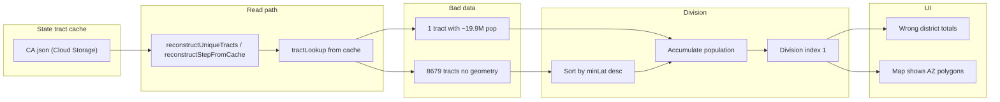

# Fix CA Step 1: Wrong State Tracts and District Totals

## Root cause summary

Two symptoms (tracts in AZ, district totals way off) share one underlying cause:

1. **State tract cache is corrupted or incomplete**
  Logs: `RECONSTRUCT FAILED: 8679 out of 9110 tracts (95.3%) are missing geometry` and `GEOMETRY MISSING: Group 2 has 8679 tracts without geometry`.  
   The cache at `gs://geodistricts-census-data/state-tracts/CA.json` is being read as an array of `[id, tract]` pairs (length 9129). Most of those `tract` objects have no `geometry`. So the cache was either written without geometry for most tracts (e.g. by an older path or minimal format) or was overwritten/corrupted.
2. **Re-execution uses the same bad cache**
  When step 1 reconstruction fails (returns `null`), the next-step handler re-executes the division. It gets `uniqueTracts` via `reconstructUniqueTracts(algorithmState)`, which reads from the **same** state tract cache. So the division runs on 9110 tract objects, most still without geometry.
3. **Division and totals**
  - `getTractBounds()` returns `{ minLat: 0, maxLat: 0, minLng: 0, maxLng: 0 }` when `!tract.geometry` ([backend/services/geodistrict-algorithm.js](backend/services/geodistrict-algorithm.js) ~461–462). So ~8679 tracts get `sortValue = 0`.  
  - Sort is by `minLat` **descending** (most north first) ([backend/services/latlong-division.js](backend/services/latlong-division.js) ~276–277). So the first tract in sorted order is one of the few with real geometry (highest `minLat`).  
  - Logs show **Division index: 1** and **First group: 1 tracts, 1,627,342 population**. So after the first tract, `accumulatedPopulation >= targetPopulation` (19,885,238). That implies one tract has population ≥ ~19.9M, which is impossible for a single census tract. So at least one tract in the cache has a wrong `properties.POPULATION` (e.g. state total or corrupted value).  
  - Totals 3,957 + 1,623,385 = 1,627,342 (what the UI shows as "State Population") come from the backend step payload's `districtGroups[].totalPopulation`, which are computed from these same tracts. So wrong cache → wrong division → wrong totals and wrong map.
4. **Map showing AZ**
  The UI's "State Population" is `currentStep.districtGroups.reduce((sum, g) => sum + g.totalPopulation, 0)` ([frontend/src/app/pages/maps-page.component.ts](frontend/src/app/pages/maps-page.component.ts) ~4503–4508). So wrong backend totals directly produce wrong UI totals. The map draws union polygons (or tract boundaries) from the step's district groups. Step 1 creates a union for "group 27-52" from **430 tracts** (log: "flattened 430 tracts to 430 polygons"). Those 430 are the subset that have geometry when building the union. If the cache had wrong geometry for those (e.g. from another state) or if a different bug mixed states, the map could show shapes in AZ. The AZ debug lines (`Test tract 04005001700 in stateTractIds: false`) in [backend/services/s4-data-loader.js](backend/services/s4-data-loader.js) are hardcoded checks for AZ tracts and are expected to be false for CA; they are not the source of the bug.

## Recommended direction

- **Primary:** Treat the current CA state tract cache as bad. Regenerate it (or overwrite it) when step 0 runs, and add validation so that if too many tracts lack geometry we do not use the cache and instead regenerate.
- **Secondary:** Harden the pipeline: validate cache on read, add a sanity check on tract population so a single tract cannot be treated as having state-scale population, and ensure the only writer of the state tract cache for step-by-step is the step 0 path that stores full GeoJSON (with geometry) for every tract.
- **Maps page:** Move step indicator into dg-header; add admin-only trash button that force-clears all cache for the selected state and reloads step 0.

## Implementation plan

### 1. Regenerate / overwrite state tract cache for CA

- **Option A (fastest):** Delete or invalidate the existing CA state tract cache (Firestore doc `state_tracts_CA` and Cloud Storage object `state-tracts/CA.json`) so the next step 0 run does not hit "State tract cache already exists for CA, skipping storage" and instead writes a fresh cache from the canonical tract model.
- **Option B (in code):** In the step-by-step flow, when preparing to cache at step 0, if the state tract cache exists but was created by an older format/version or is missing geometry for more than a small fraction of tracts, overwrite it instead of skipping. That implies loading the existing cache, sampling (or counting) tracts with `geometry`, and if e.g. < 95% have geometry, treat as invalid and write the new tract map from the current step 0 run.

Implementation detail: Today the "skip storage" happens in [backend/index.js](backend/index.js) around 4854–4856 (`State tract cache already exists for ${state}, skipping storage`). The condition is a simple "cache exists" check (e.g. Firestore doc exists or Cloud Storage file exists). Either:

- Add a "force regenerate" path (e.g. query param or env) that deletes the cache and then runs step 0 as usual, or
- When cache "exists", fetch it, validate geometry coverage, and if below threshold delete and write the new tract map from the current canonical result.

### 2. Validate state tract cache when reading

- In **reconstructUniqueTracts** ([backend/index.js](backend/index.js) ~3325–3411): after building `lookupMap` from `tractMap`, sample tracts (e.g. 100) and count how many have `t.geometry`. If more than a threshold (e.g. 5%) lack geometry, treat the cache as invalid: log an error, do not use it, and return empty array (or throw) so callers do not use partial data. Optionally delete or mark the cache as invalid so the next step 0 can overwrite.
- In **reconstructStepFromCache** ([backend/index.js](backend/index.js) ~5829–6165): the existing "RECONSTRUCT FAILED" when `totalTractsWithoutGeometry > 0` (6070–6075) already returns `null` and forces re-execution. Keep that. The important addition is ensuring that re-execution does not keep using a bad cache; that is addressed by fixing `reconstructUniqueTracts` and by regenerating the cache (above).

### 3. Sanity check on tract population before division

- In the division path (e.g. in [backend/services/latlong-division.js](backend/services/latlong-division.js) in `findDivisionIndex` or the caller that builds `tractsWithBounds`), after computing `population` per tract, if any single tract has `population` > a reasonable maximum (e.g. 500,000 or 1% of state population), log a clear error and optionally cap or reject so we never get "division index 1" with 19.9M in one tract. This defends against corrupted `properties.POPULATION` even if the cache is fixed later.

### 4. Ensure step 0 is the single writer for state tract cache (step-by-step)

- Confirm that for step-by-step execution, the **only** place that writes `state_tracts_${state}` is the step 0 block in [backend/index.js](backend/index.js) that builds `tractMap` from `canonicalResult.tractMap` (4761–4778) and then stores it (4795–4855). That path includes full geometry for every canonical tract that has geometry (9110 for CA; 19 without TIGER stay without geometry). No other path (e.g. run-to-completion or legacy) should overwrite this cache with a minimal or partial format. Add a short comment or assert so future changes do not introduce a second writer that strips geometry.

### 5. Maps page UI changes (required)

- **Move `.step-indicator` from `.step-btn-bar` into `.dg-header**`
  - Today the step text ("Step X of Y") lives inside [frontend/src/app/components/step-btn-bar.component.html](frontend/src/app/components/step-btn-bar.component.html) as a `` (lines 65–67). Move this out of the step-btn-bar component.
  - In [frontend/src/app/pages/maps-page.component.html](frontend/src/app/pages/maps-page.component.html), add the step indicator inside the existing `.dg-header` (e.g. in `.dg-header-left` or a new slot), so it appears next to "N California GeoDistricts" and the State Population / Target DG Population values. Pass `currentStepIndex` and `getTotalSteps()` from the maps page (already available) into the template for the step indicator. Remove the step-indicator from step-btn-bar (and remove the corresponding `@Input()`s from the component if they are only used for that).
  - Adjust [frontend/src/app/pages/maps-page.component.scss](frontend/src/app/pages/maps-page.component.scss) (and step-btn-bar styles if needed) so `.step-indicator` is styled correctly in its new position in `.dg-header`.
- **Add trash can icon button (admin only) to right of refresh button; click = forceRefresh clearing all cache for selected state**
  - When in **admin mode** (URL hash `#admin`), show a trash can icon button to the **right of the refresh (restart) button**. The refresh button is the "Restart algorithm" button in [frontend/src/app/components/step-btn-bar.component.html](frontend/src/app/components/step-btn-bar.component.html) (restart-alt icon, `onRestart()`). So the trash button should be placed next to it (e.g. only in admin variant, after the restart button).
  - **Click behavior (forceRefresh):** When the user clicks the trash button, perform a **force refresh** that clears **all** cache state for the selected state: (1) Call the backend to invalidate algorithm and step caches for that state (e.g. use or extend [frontend/src/app/services/geodistrict-cache.service.ts](frontend/src/app/services/geodistrict-cache.service.ts) `invalidate` / `invalidateState`, and ensure backend clears algorithm state + step caches + optionally state tract cache for that state). (2) Clear frontend in-memory and any local state for that state. (3) Then trigger the same "reset to step 0" flow but with **forceInvalidate: true** so the backend does not use cached step 0 and re-runs initialization (and can rewrite the state tract cache). So the trash button is like the refresh/restart button but with full cache clear + forceInvalidate.
  - Implementation notes: The current restart button calls `(restart)="resetToStart()"` and [maps-page.component.ts](frontend/src/app/pages/maps-page.component.ts) `resetToStart()` uses `forceInvalidate: false`. Add a new method (e.g. `forceRefreshAndReset()`) that first invalidates cache for the selected state (backend + frontend), then calls the step-by-step endpoint with `options: { forceInvalidate: true }` and otherwise mirrors the reset-to-step-0 flow. Expose the trash button in the step-btn-bar (admin variant only) with an output like `(clearCache)="forceRefreshAndReset()"` or pass a single "restart" mode: `restartMode: 'normal' | 'forceRefresh'` and one button for normal restart and one for forceRefresh. Prefer Material icon `delete` or `delete_forever` for the trash button.

## Files to touch

| Area           | File                                                                                                                                                                                                                                                                                                                               | Change                                                                                                                                                                                                                      |
| -------------- | ---------------------------------------------------------------------------------------------------------------------------------------------------------------------------------------------------------------------------------------------------------------------------------------------------------------------------------- | --------------------------------------------------------------------------------------------------------------------------------------------------------------------------------------------------------------------------- |
| Cache write    | [backend/index.js](backend/index.js)                                                                                                                                                                                                                                                                                               | Step 0: only skip storing state tract cache if existing cache is valid (e.g. sample and require >95% tracts with geometry); otherwise overwrite. Optionally support "force regenerate" (param or env) to delete then write. |
| Cache read     | [backend/index.js](backend/index.js)                                                                                                                                                                                                                                                                                               | `reconstructUniqueTracts`: after building lookup from tract cache, validate geometry coverage; if too many tracts missing geometry, treat cache as invalid (return [] or throw, optionally delete cache).                   |
| Division guard | [backend/services/latlong-division.js](backend/services/latlong-division.js)                                                                                                                                                                                                                                                       | Before or inside population accumulation, detect any tract with population > threshold (e.g. 500k); log error and optionally cap or fail fast.                                                                              |
| Single writer  | [backend/index.js](backend/index.js)                                                                                                                                                                                                                                                                                               | Comment in step 0 path that it is the single writer for state tract cache in step-by-step flow.                                                                                                                             |
| Step indicator | [frontend/src/app/components/step-btn-bar.component.html](frontend/src/app/components/step-btn-bar.component.html), [frontend/src/app/pages/maps-page.component.html](frontend/src/app/pages/maps-page.component.html), maps-page.component.scss / step-btn-bar.component.scss                                                     | Move step-indicator from step-btn-bar into maps-page .dg-header; adjust styles.                                                                                                                                             |
| Trash button   | [frontend/src/app/components/step-btn-bar.component.html](frontend/src/app/components/step-btn-bar.component.html), [frontend/src/app/components/step-btn-bar.component.ts](frontend/src/app/components/step-btn-bar.component.ts), [frontend/src/app/pages/maps-page.component.ts](frontend/src/app/pages/maps-page.component.ts) | Add trash icon button (admin only) to right of refresh; on click call new forceRefreshAndReset() that invalidates cache for state then reloads step 0 with forceInvalidate: true.                                           |

## Verification

- After regenerating the CA state tract cache and deploying changes:
  - Run CA step 0, then step 1. Step 1 should show two groups with ~50/50 population (e.g. ~19.9M each), not 3,957 vs 1,623,385.
  - UI "State Population" should be ~39.7M for CA.
  - Map should show district group polygons over California, not Arizona.
- Maps page: Step indicator appears in .dg-header; in #admin, trash button appears to the right of the restart button; clicking trash clears all cache for the selected state and reloads step 0 with a fresh backend run.
- Optionally run the same flow for another large state (e.g. TX) to ensure cache validation and overwrite logic do not break normal behavior.

## Mermaid: data flow (current failure)

