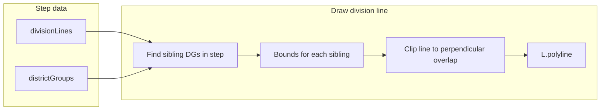

# Division lines along sibling shared borders

## Current behavior

- When "Show division lines" is on and stepping through steps, the map adds **static** division lines for all previous steps and **animated** lines for the current step ([maps-page.component.ts](frontend/src/app/pages/maps-page.component.ts) ~4193–4211).
- Each line is created in `createStaticDivisionLine` / `createAnimatedDivisionLine` using **parent group bounds** from the **previous** step: a single straight segment at the division coordinate (lat or lng) spanning the full parent extent ([maps-page.component.ts](frontend/src/app/pages/maps-page.component.ts) ~4272–4337, ~4372+).
- Counts already match the desired pattern: Step 1 has 1 division, Step 2 adds 2 (3 total), Step 3 adds 4 (7 total), via `step.divisionLines` per step.

## Goal

- Keep the same **count** of division lines (1 after Step 1, 3 after Step 2, 7 after Step 3).
- Draw each line **along the shared border** between the two sibling DGs—i.e. restrict each line to where those two groups actually meet, so the division is easy to see and does not overshoot into areas that belong to only one sibling.

## Approach

**Phase 1: Clip line to sibling bounds overlap (recommended first)**

- For each `DivisionLineInfo`, `siblingGroups` is already set by the backend ([geodistrict-algorithm.js](backend/services/geodistrict-algorithm.js) ~2042–2059) and normalized in cache ([backend/index.js](backend/index.js) ~8036–8053). Use it when present.
- In the step we’re drawing (e.g. `loadedSteps[stepIdx]`), the two sibling DGs exist in `step.districtGroups`. Find the two groups that match `siblingGroups[0]` and `siblingGroups[1]` by `startDistrictNumber` / `endDistrictNumber`.
- Add a small helper that, given a step and a group key (start/end district numbers), returns `L.LatLngBounds` for that group (using existing `calculateGroupBounds(tracts)` and the group’s `censusTracts`; or `group.bounds` if present).
- For each division line:
  - If `siblingGroups` has length 2, get bounds A and B for the two siblings in that step.
  - **Latitude division** (line at fixed lat): restrict the line’s longitude to the intersection of the two groups’ lng ranges: `lngMin = max(A.west, B.west)`, `lngMax = min(A.east, B.east)`. If `lngMin >= lngMax`, fall back to current behavior (parent bounds).
  - **Longitude division**: restrict the line’s latitude to `latMin = max(A.south, B.south)`, `latMax = min(A.north, B.north)`; same fallback if invalid.
- Use these clipped coordinates in both `createStaticDivisionLine` and `createAnimatedDivisionLine` (and any shared line-building helper you introduce). When `siblingGroups` is missing or not length 2, keep using parent bounds as today.

This yields straight lines that run only along the “overlap” extent where the two siblings meet, which already improves clarity (e.g. no line across the whole state when only two DGs touch in the middle).

**Phase 2 (optional): True shared boundary polyline**

- If union polygons exist for both sibling DGs in that step (e.g. from step cache or from building unions from tracts), the line could be drawn along the **actual** shared boundary: extract boundary of each union (e.g. `turf.polygonToLine`), find segments that belong to both (segment equality with tolerance), merge into one or more polylines and draw them.
- Frontend already has `@turf/turf` ([frontend/package.json](frontend/package.json)); [geodistrict-algorithm.service.ts](frontend/src/app/services/geodistrict-algorithm.service.ts) imports it. Maps page would need to use turf and to receive or compute union polygons per DG for the step being drawn.
- This is more involved (segment matching, MultiPolygon handling, and ensuring union data is available for all steps). Recommend implementing Phase 1 first and treating Phase 2 as a follow-up enhancement.

## Implementation details (Phase 1)

- **Where:** [frontend/src/app/pages/maps-page.component.ts](frontend/src/app/pages/maps-page.component.ts)
- **Helper:** Add e.g. `getBoundsForGroupInStep(step: GeodistrictStep, start: number, end: number): L.LatLngBounds | null` that finds the group in `step.districtGroups` and returns bounds via `group.bounds` or `this.calculateGroupBounds(group.censusTracts)`.
- **Clip logic:** In both `createStaticDivisionLine` and `createAnimatedDivisionLine`, after resolving parent `groupBounds`:
  - If `divLineInfo.siblingGroups?.length === 2`, resolve the step for this division (e.g. `this.loadedSteps[stepIdx]` for static; same for animated) and get bounds for sibling 1 and sibling 2. Compute perpendicular overlap (lng for lat-division, lat for lng-division). If overlap is valid, build `lineCoordinates` using the division value and the overlapping range only; otherwise keep using parent bounds.
- **Popup/labels:** No change needed; they already describe the division and parent group.
- **Tests:** Manually verify Step 1 (one line between two DGs), Step 2 (three lines), Step 3 (seven lines), and that each line is clipped to the sibling interface (no long line through areas that belong to only one DG).

## Data flow (high level)

## Summary

- **Feasible:** Yes. Use existing `divisionLines` and `siblingGroups`; clip each division line to the intersection of the two sibling DGs’ bounds in the step where that division occurs.
- **Scope:** Phase 1 is frontend-only in the maps page (helper + clip in both static and animated line creation). Phase 2 would add turf-based shared-boundary extraction when union polygons are available.
