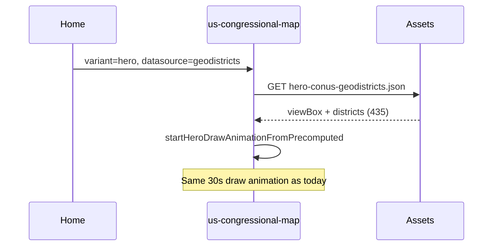

# Hero map: GeoDistricts (435) as alternative to Lewis 119

## Goal

Replace or augment the current animated hero (Lewis 119 CONUS SVGs) with the **435 GeoDistricts** polygons, while keeping the same hero behavior (single load, draw animation, optional raster fallback) as in [hero_map_performance_8bbc713c.plan.md](.cursor/plans/hero_map_performance_8bbc713c.plan.md).

## Recommended approach: datasource input on existing component

Extend [us-congressional-map.component.ts](frontend/src/app/components/us-congressional-map.component.ts) with a **datasource** input and keep one component for both Lewis 119 and GeoDistricts hero. GeoDistricts as default aligns the hero with the product message (“435 Congressional Districts … Drawn by Geography”).

- **Reuse:** Same hero animation (`runHeroDrawAnimation`), same payload shape (`HeroConusPayload`), same CONUS projection (viewBox 800×500, `CONUS_BOUNDS`), same template/SCSS.
- **Performance:** One request per hero type: `hero-conus-geodistricts.json` for GeoDistricts, existing `hero-conus-119.json` for Lewis 119. No 48× final-step calls on the client.

## Data flow (target)

## Implementation

### 1. Component: add datasource input and hero branch

**File:** [frontend/src/app/components/us-congressional-map.component.ts](frontend/src/app/components/us-congressional-map.component.ts)

- Add `@Input() datasource: 'geodistricts' | 'lewis119' = 'geodistricts'`.
- In `loadBoundaries()`, when `variant === 'hero' && !showInsetStates`:
  - If `datasource === 'geodistricts'`: call new `loadStaticHeroGeodistricts()` which fetches `assets/hero-conus-geodistricts.json` and runs `startHeroDrawAnimationFromPrecomputed(payload.districts)` (existing method).
  - If `datasource === 'lewis119'`: keep current `loadStaticHero()` (existing `hero-conus-119.json`).
- Raster fallback in template: when `variant === 'hero'` and `datasource === 'geodistricts'`, show `hero-conus-geodistricts-light.webp` / `hero-conus-geodistricts-dark.webp` if you add them; otherwise keep showing the existing Lewis raster or a single GeoDistricts raster so the hero never appears blank. Optional: add a small `heroRasterPath` getter so asset paths depend on `datasource`.

**File:** [frontend/src/app/components/us-congressional-map.component.html](frontend/src/app/components/us-congressional-map.component.html)

- Make hero raster `src` depend on `datasource` (e.g. `hero-conus-119-*` vs `hero-conus-geodistricts-*`), or keep one set until GeoDistricts rasters exist.

**File:** [frontend/src/app/pages/home-page.component.html](frontend/src/app/pages/home-page.component.html)

- Pass `datasource="geodistricts"` (or rely on default) on `<app-us-congressional-map>` so the hero uses GeoDistricts by default.

No change to non-hero behavior (Lewis API/fallback remains for `variant === 'default'`).

### 2. Producing the GeoDistricts hero asset (same shape as Lewis)

Payload shape must match existing `HeroConusPayload`: `{ viewBox: "0 0 800 500", districts: [ { paths: string[], stateKey: string }, ... ] }` with **435** entries (one per district). `stateKey` should be the **state name** (e.g. "Alabama") so the existing draw animation grouping and “last district in state” behavior stay correct.

Two ways to produce it:

**Option A – Build script (recommended for performance and offline)**

- **New or extended script** (e.g. `scripts/build-hero-geodistricts.js` or extend [scripts/build-hero-asset.js](scripts/build-hero-asset.js)):
  - **Source of GeoDistricts geometry:** Call backend for all CONUS final steps. Easiest: script runs against a running backend; `GET /api/algorithm/final-step-states`, then for each CONUS state code `GET /api/algorithm/final-step/:state`. Alternatively, add a single **backend export endpoint** used only by the script, e.g. `GET /api/algorithm/hero-geodistricts-export` that returns all CONUS final steps in one response (aggregate from Firestore + optional in-memory cache), so the script does one request.
  - **Conversion:** For each state’s final step, take `stepData.districtGroups`. For each group, get `unionPolygons` (or `unionPolygon` as single-element array). Each element is GeoJSON `{ type: 'Feature', geometry: { type: 'Polygon'|'MultiPolygon', coordinates } }`. Reuse the same projection as Lewis: CONUS_BOUNDS (e.g. minLng -125, maxLng -66, minLat 24, maxLat 50, x1 40, y1 40, x2 760, y2 460). Port or share the logic from [scripts/build-hero-asset.js](scripts/build-hero-asset.js) (`project`, `ringToPathD`, `geometryToPathDs`, `featureCollectionToPathDsByFeature`) so that each district becomes one `{ paths: string[], stateKey: stateName }` entry. State name can be resolved from state code via a small map (e.g. AL → Alabama).
  - **Output:** Write `frontend/public/assets/hero-conus-geodistricts.json`. Optionally reduce path precision (1–2 decimals) to shrink size.
  - **Optional raster:** Reuse the Puppeteer-based SVG→WebP pipeline from the Lewis script to generate `hero-conus-geodistricts-light.webp` and `hero-conus-geodistricts-dark.webp` for instant hero fallback.
- **When to run:** As part of release or after algorithm/cache updates (e.g. “rebuild hero assets”). Document in README or a short doc.

**Option B – Backend “hero” endpoint (single live request)**

- **New route:** e.g. `GET /api/algorithm/hero-geodistricts`.
- **Backend:** In [backend/index.js](backend/index.js), aggregate CONUS final steps (same Firestore/cache used by `getFinalStep`). For each state’s final step, iterate `districtGroups`, collect union polygon geometries, then run CONUS projection (port [frontend/src/app/utils/geo-svg.ts](frontend/src/app/utils/geo-svg.ts) logic to Node, or a small shared JS module). Return `{ viewBox: "0 0 800 500", districts: [ { paths, stateKey }, ... ] }`.
- **Frontend:** When `variant === 'hero' && datasource === 'geodistricts'`, call this endpoint instead of loading a static JSON asset; then call `startHeroDrawAnimationFromPrecomputed(response.districts)`.
- **Tradeoff:** One round trip, no static file; backend does projection and aggregation (can cache the response by algorithm version to avoid repeated work).

Recommendation: **Option A (build script)** for the same benefits as the current Lewis hero (one static asset, cacheable, no backend load on every home visit). Add Option B later if you want the hero to always reflect the latest cached algorithm run without rebuilding assets.

### 3. Fallback and robustness

- If `hero-conus-geodistricts.json` is missing or fails to load, either:
  - Fall back to Lewis hero (load `hero-conus-119.json`) so the hero still animates, or
  - Rely on raster-only (if GeoDistricts raster exists) and do not run the SVG animation.
- Document that the GeoDistricts hero asset must be generated (and optionally the rasters) when algorithm or CONUS final steps change.

### 4. Optional: raster assets for GeoDistricts

To match current Lewis hero behavior (instant raster, then SVG draw on top), add:

- `hero-conus-geodistricts-light.webp` / `hero-conus-geodistricts-dark.webp` produced by the build script (same Puppeteer path as in [scripts/build-hero-asset.js](scripts/build-hero-asset.js)).
- Template/component logic so that when `datasource === 'geodistricts'` the hero shows these rasters; when `datasource === 'lewis119'` it keeps showing the existing Lewis rasters.

If you skip rasters for GeoDistricts initially, the hero can still show the SVG animation only (or a single shared raster) to keep the first implementation smaller.

---

## Alternative: Dedicated hero component

Instead of a datasource input, introduce a **separate** component (e.g. `hero-geodistricts-map`) that only knows about GeoDistricts: loads `hero-conus-geodistricts.json`, runs the same animation, same CONUS view. Home page would use this component instead of `app-us-congressional-map` for the hero. Pros: single responsibility, no Lewis code in the hero path. Cons: duplicated animation and projection logic (or shared via a small service/utility), and no built-in way to toggle hero to Lewis without swapping the component. This achieves the “same map hero” with GeoDistricts only; if you want to keep the option to show Lewis 119 in the hero, the datasource approach is simpler.

---

## Files to touch (summary)

| Area                           | Files                                                                                                                                                                                                                                                                                                                                                                                                   |
| ------------------------------ | ------------------------------------------------------------------------------------------------------------------------------------------------------------------------------------------------------------------------------------------------------------------------------------------------------------------------------------------------------------------------------------------------------- |
| **Component + home**           | [us-congressional-map.component.ts](frontend/src/app/components/us-congressional-map.component.ts) (datasource input, `loadStaticHeroGeodistricts()`), [us-congressional-map.component.html](frontend/src/app/components/us-congressional-map.component.html) (raster src by datasource if needed), [home-page.component.html](frontend/src/app/pages/home-page.component.html) (datasource or default) |
| **Build script**               | New `scripts/build-hero-geodistricts.js` (or extend `build-hero-asset.js`) – fetch CONUS final steps, project to paths, write `hero-conus-geodistricts.json` (+ optional WebP)                                                                                                                                                                                                                          |
| **Assets**                     | `frontend/public/assets/hero-conus-geodistricts.json` (output of script); optional `hero-conus-geodistricts-*.webp`                                                                                                                                                                                                                                                                                     |
| **Backend (only if Option B)** | [backend/index.js](backend/index.js) (new route), Node projection helper (port of geo-svg CONUS logic)                                                                                                                                                                                                                                                                                                  |

---

## Suggested implementation order

1. **Build script for GeoDistricts hero asset** – Fetch CONUS final steps (48× final-step or one export endpoint), project district union polygons to CONUS path `d` strings, write `hero-conus-geodistricts.json`. Ensure state names are correct for `stateKey`.
2. **Component changes** – Add `datasource` input, `loadStaticHeroGeodistricts()`, wire hero branch to use GeoDistricts asset when `datasource === 'geodistricts'`; default `datasource` to `'geodistricts'`. Update home page to rely on default or set `datasource="geodistricts"`.
3. **Raster (optional)** – Add GeoDistricts WebP generation to the build script and wire hero raster `src` by `datasource`.
4. **Fallback** – If GeoDistricts asset load fails, optionally load Lewis hero or show raster-only so the hero never stays blank.

