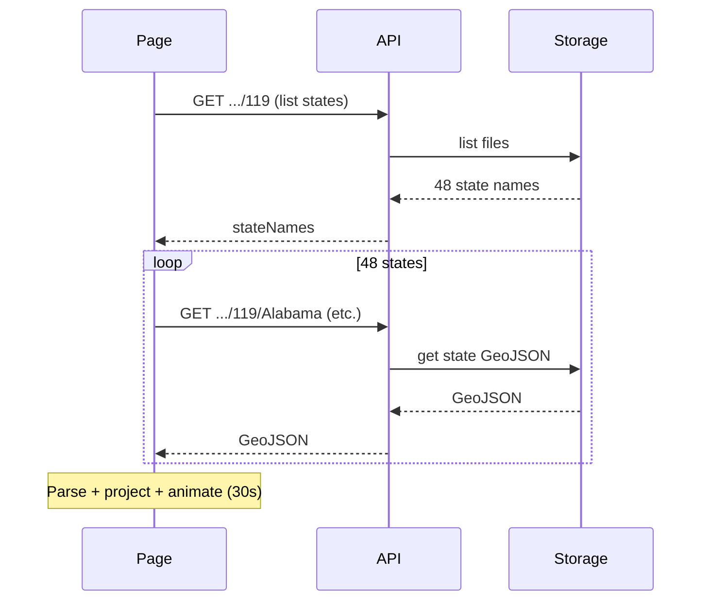

# Home page hero map performance

## Current behavior and bottleneck

The hero uses [us-congressional-map.component.ts](frontend/src/app/components/us-congressional-map.component.ts) with `variant="hero"` and `showInsetStates=false` (CONUS only). On load it:

1. **Many HTTP requests**
  - 1 × `GET /api/congressional-boundaries/119` (state list)
  - 48 × `GET /api/congressional-boundaries/119/:state` (one per CONUS state)
  - 2 × algorithm step requests for AK and HI (unused when insets are off)
2. **Heavy client work**
  - Parse 48 GeoJSON FeatureCollections
  - Project all coordinates to SVG bounds (CONUS_BOUNDS, viewBox `0 0 800 500`) via [geo-svg.ts](frontend/src/app/utils/geo-svg.ts)
  - Build path `d` strings per district, then run a 30s staggered “draw” animation

On mobile/cellular, 50+ round trips and large GeoJSON payloads cause the main delay; parsing and projection add more cost.

---

## Recommended approaches

### Option A: Static precomputed hero asset (recommended for mobile)

**Idea:** Precompute CONUS district paths once (same projection as today) and ship a single JSON file. Hero loads one asset and runs the existing animation over that data.

- **Asset:** e.g. `frontend/src/assets/hero-conus-119.json` with shape:
  - `{ "viewBox": "0 0 800 500", "districts": [ { "paths": ["M...", "..."], "stateKey": "Alabama" }, ... ] }`
  - One entry per district; `paths` is the array of path `d` strings for that district (matches current `featureCollectionToPathDsByFeature`).
- **Build script:** Add a Node script (e.g. under `backend/scripts/` or `scripts/`) that:
  - Reads CONUS state GeoJSON for Congress 119 (from cloud storage or Lewis repo; ingest already exists in [ingest-lewis-boundaries.js](backend/scripts/ingest-lewis-boundaries.js)).
  - Ports or reuses the projection logic (CONUS_BOUNDS, viewBox 800×500) from [geo-svg.ts](frontend/src/app/utils/geo-svg.ts) so output matches the frontend exactly.
  - Writes the above JSON. Optionally reduce path precision (e.g. 1–2 decimals) to shrink file size.
- **Frontend:** In [us-congressional-map.component.ts](frontend/src/app/components/us-congressional-map.component.ts), when `variant === 'hero' && congress === 119`:
  - Call `HttpClient.get<HeroPathPayload>('assets/hero-conus-119.json')` (or path from environment) instead of `getBoundariesByCongress` + step0.
  - Adapt the result into the same structure `startHeroDrawAnimation` expects (list of `{ state, districts }`), then call the existing animation logic.
- **Fallback:** If asset missing or other congress, keep current API-based load so non-hero and other congresses still work.

**Pros:** One request, no GeoJSON parsing or projection on client, cacheable, works offline after first load.  
**Cons:** One-time (or per-Congress) build step; hero is fixed to 119 unless you add more assets or fallback.

---

### Option B: Backend “hero” endpoint (single response)

**Idea:** One API call that returns all CONUS path data for a given Congress, so the client never does 48 requests or GeoJSON parsing for the hero.

- **New route:** e.g. `GET /api/congressional-boundaries/:congress/hero`
- **Backend:** In [backend/index.js](backend/index.js) and cloud storage layer:
  - List CONUS states for that Congress (exclude Alaska, Hawaii).
  - Fetch all CONUS state GeoJSON from [cloud-storage-cache.js](backend/services/cloud-storage-cache.js).
  - Run the same projection as the frontend (port [geo-svg](frontend/src/app/utils/geo-svg.ts) logic to Node, or share via a small JS module) and build the `districts` array of `{ paths, stateKey }`.
  - Return one JSON body with `viewBox` and `districts`.
- **Frontend:** For `variant === 'hero'`, call this endpoint instead of `getBoundariesByCongress` + steps; then run existing hero animation on the response.

**Pros:** No frontend asset; supports any Congress; one round trip.  
**Cons:** Backend must implement projection; first load still downloads full path set in one response (could be large).

---

### Option C: Quick wins (no new asset or endpoint)

- **Skip AK/HI when hero and no insets:** In [us-congressional-map.component.ts](frontend/src/app/components/us-congressional-map.component.ts) `loadBoundaries()`, when `variant === 'hero' && !this.showInsetStates`, do not request `getStep('AK', ...)` or `getStep('HI', ...)`. Use `forkJoin({ byState: ... })` with only the boundaries call, and pass `null` for step0Ak/step0Hi into `startHeroDrawAnimation`. Saves two HTTP requests and avoids waiting on algorithm steps.
- **Shorter animation (optional):** Reduce `HERO_DRAW_DURATION_MS` (e.g. 30s → 15s) so the “final” state appears sooner; same visual, less perceived wait.

---

### Option D: Raster fallback (fastest, different tradeoff)

**Idea:** Pre-render the CONUS map as a static image (WebP or PNG, e.g. 1600×1000 for 2×). Hero uses the image as background with a simple fade-in; no district-level draw animation.

- **Pros:** Single small asset, very fast on cellular.
- **Cons:** No “drawing” animation; less crisp if users zoom.

Can be combined with Option A: show the image immediately and optionally replace with the SVG animation when the precomputed JSON has loaded (or skip replacement on slow connections).

---

## Suggested implementation order

1. **Quick win:** Implement Option C (skip AK/HI for hero, optional shorter duration).
2. **Main fix:** Implement Option A (static `hero-conus-119.json` + hero branch in the component). Add the build script and wire the component to use the asset when `variant === 'hero' && congress === 119`.
3. **Optional:** Add Option B later if you want hero for other Congresses without shipping more static files, or Option D as an instant fallback image.

---

## Files to touch (summary)

| Approach             | Files                                                                                                                                                                                                                                                                                                                                                                        |
| -------------------- | ---------------------------------------------------------------------------------------------------------------------------------------------------------------------------------------------------------------------------------------------------------------------------------------------------------------------------------------------------------------------------- |
| **A – Static asset** | New: `frontend/src/assets/hero-conus-119.json`; new script (e.g. `scripts/build-hero-asset.js` or under `backend/scripts/`); [us-congressional-map.component.ts](frontend/src/app/components/us-congressional-map.component.ts) (hero branch + HTTP get asset); optionally `angular.json` to ensure asset copied.                                                            |
| **B – Backend hero** | [backend/index.js](backend/index.js) (new route); backend module that does CONUS projection (port of geo-svg); [congressional-boundaries.service.ts](frontend/src/app/services/congressional-boundaries.service.ts) (hero method); [us-congressional-map.component.ts](frontend/src/app/components/us-congressional-map.component.ts) (use hero endpoint when variant=hero). |
| **C – Quick wins**   | [us-congressional-map.component.ts](frontend/src/app/components/us-congressional-map.component.ts) only (`loadBoundaries` and optionally `HERO_DRAW_DURATION_MS`).                                                                                                                                                                                                           |

No change to the hero’s purpose (animated CONUS background); only how and how quickly the data is loaded.