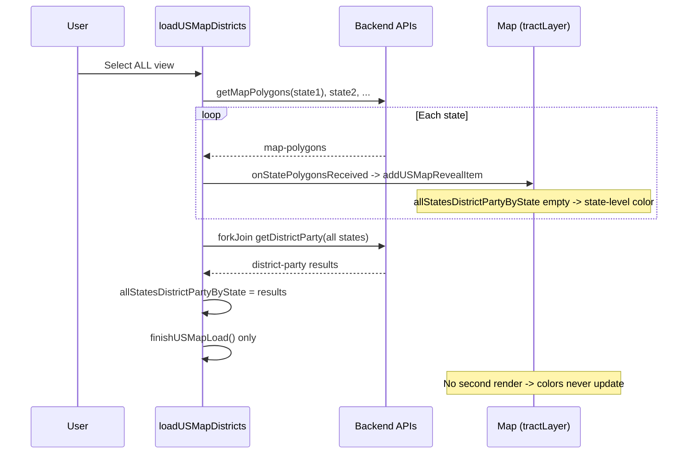

# Fix: Party colors missing on initial All view, visible after returning from state

## Root cause

Two code paths affect the All-states map:

**1. Fresh load (no cache)** — [loadUSMapDistricts](frontend/src/app/pages/maps-page.component.ts) (lines 964–1021)

- Fetches map polygons **sequentially** per state via `concatMap(getMapPolygons(stateCode))`.
- On each response, [onStatePolygonsReceived](frontend/src/app/pages/maps-page.component.ts) (918–934) runs and calls [addUSMapRevealItem](frontend/src/app/pages/maps-page.component.ts) for the state outline and each district. Polygons are drawn **immediately** as they arrive.
- At that time `allStatesDistrictPartyByState` is still **empty** (it is only filled in the stream’s `complete` callback, after all polygon fetches).
- [getUSMapDistrictFillColor](frontend/src/app/pages/maps-page.component.ts) (4654–4666) uses `allStatesDistrictPartyByState[stateCode]?.[groupKey]` when present; otherwise it falls back to state-level party (e.g. 119th Congress). So the first paint uses **state-level** color for every district.
- When the sequential stream **completes**, the code runs `forkJoin` to fetch district-party for all states with a final step, then in the subscribe:
  - Sets `allStatesDistrictPartyByState` from results.
  - Calls **only** `finishUSMapLoad()` — it **does not** call `renderUSMapDistricts()` again.
- Result: polygons stay with the initial state-level coloring; district-level party is never applied.

**2. Return from state (cache restore)** — same file, [onStateChange](frontend/src/app/pages/maps-page.component.ts) (714–751)

- Restores `usMapStepDataByState` from `cachedUSMapStepDataByState`.
- Calls `renderUSMapDistricts(this.usMapStepDataByState)` once (polygons drawn; party may still be from cache or empty).
- Then runs `forkJoin` for district-party; in subscribe it sets `allStatesDistrictPartyByState` and **calls `renderUSMapDistricts(this.usMapStepDataByState)` again** (line 743).
- Result: second render uses district-party data, so colors appear.

So the bug is: **on fresh load, the map is never re-rendered after `allStatesDistrictPartyByState` is populated.**

After return from state, the cache path does the extra `renderUSMapDistricts()` after setting party data, so the map updates.

## Fix

In [loadUSMapDistricts](frontend/src/app/pages/maps-page.component.ts), inside the `forkJoin` subscribe (after populating `allStatesDistrictPartyByState`), call `**this.renderUSMapDistricts(this.usMapStepDataByState);**` before `this.finishUSMapLoad();`. That re-draws all district polygons with the correct fill colors from `getUSMapDistrictFillColor` (which already reads `allStatesDistrictPartyByState`).

- **Location:** [maps-page.component.ts](frontend/src/app/pages/maps-page.component.ts) around lines 1003–1008.
- **Change:** After `results.forEach((r) => { this.allStatesDistrictPartyByState[r.state] = r.districts ?? {}; });`, add:
  - `this.renderUSMapDistricts(this.usMapStepDataByState);`
  - then call `this.finishUSMapLoad();` as today.

Optional consistency improvement: In [renderUSMapDistricts](frontend/src/app/pages/maps-page.component.ts) (1136–1191), when `allStatesParty` is present, set the layer style `color` from `getTractBorderColorByParty(allStatesParty.pctDem)` (instead of hardcoded `'#000000'`) and store that in `tractGeoJsonLayerBorderColors` so [updateUSMapPolygonWeights](frontend/src/app/pages/maps-page.component.ts) (1194–1209) keeps border colors correct on zoom. This matches [addUSMapRevealItem](frontend/src/app/pages/maps-page.component.ts) (894, 1172, 1183), which already uses party-based borders and `tractGeoJsonLayerBorderColors`.

## Unrelated note (terminal logs)

The terminal shows `GET /api/algorithm/step/AL/3/union-polygons` returning 404 while the build-all-union-polygons job is still running. That is a separate timing issue (client requesting union polygons before the async job has written them); fixing the missing re-render above does not depend on it.