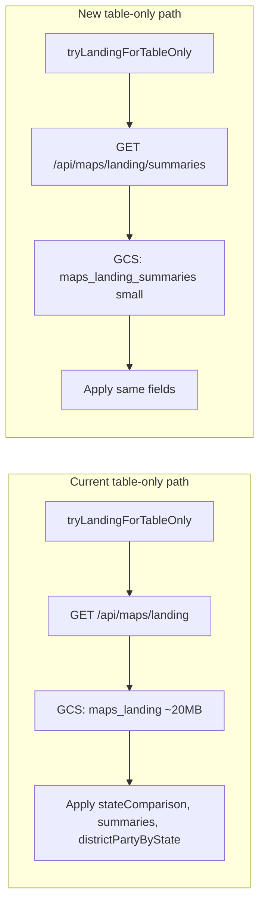

# Maps landing summaries endpoint

## Goal

Introduce a new endpoint that returns only the summary data needed to build the All-states districts list (state comparison, party summaries, district-party by state). The frontend will call this instead of `GET /api/maps/landing` when it only needs table data, avoiding the ~20MB polygon payload.

## Data flow (current vs new)

## Backend

### 1. New GCS blob for summaries-only

- In [backend/services/cloud-storage-cache.js](backend/services/cloud-storage-cache.js), add a mapping for a new cache key (e.g. `maps_landing_summaries`) to a GCS path such as `data/maps_landing_summaries.json` (same pattern as `maps_landing` → `data/maps_landing.json`).

### 2. Write summaries blob when generating landing

- In [backend/index.js](backend/index.js), in the `POST /api/admin/maps-landing/generate` handler, after building the full payload and calling `cloudStorageCache.set('maps_landing', payload, ...)`, build a summaries-only object:
  - `stateComparison`, `statePartySummaries`, `districtPartyByState`, and optionally `meta` (no `polygonsByState`).
- Call `cloudStorageCache.set('maps_landing_summaries', summariesPayload, ...)` so the small blob is written to GCS whenever the full landing is generated.

### 3. New GET endpoint

- Add `GET /api/maps/landing/summaries` in [backend/index.js](backend/index.js):
  - Read from `cloudStorageCache.get('maps_landing_summaries')`.
  - If present and valid (e.g. has `stateComparison` or `statePartySummaries`), return it as JSON.
  - If missing, return 404 with a short message so the frontend can keep existing fallback behavior (e.g. no table data or other endpoints).
  - On error, return 500.

Response shape (same as the subset used today by the frontend):

- `stateComparison?: { us, states }`
- `statePartySummaries?: { summaries: Record<string, { pctDem, pctRep, geodistrictsD, geodistrictsR, swing }> }`
- `districtPartyByState?: Record<string, Record<string, { pctDem, pctRep, votesDem, votesRep, totalVotes }>>`
- `meta?` (optional)

No changes to existing `GET /api/maps/landing` or to fallbacks that read `maps_landing` (e.g. in `resolveStateComparison` or state-party-summaries) are required for this plan; those can continue to use the full blob. Optionally, fallbacks could later be updated to prefer `maps_landing_summaries` for summary fields to avoid pulling the full blob, but that is out of scope unless you want it included.

## Frontend

### 4. Use new endpoint for table-only

- In [frontend/src/app/pages/maps-page.component.ts](frontend/src/app/pages/maps-page.component.ts):
  - Add a constant for the new URL, e.g. `MAPS_LANDING_SUMMARIES_URL = ${environment.apiUrl}/maps/landing/summaries`.
  - Define a response type (or reuse a subset of `MapsLandingResponse`) for the summaries response: `stateComparison`, `statePartySummaries`, `districtPartyByState` (and optional `meta`).
  - In `tryLandingForTableOnly()`, replace the request to `MAPS_LANDING_URL` with a request to `MAPS_LANDING_SUMMARIES_URL`. Keep the same success handling: set `stateComparison`, `statePartySummaries` from `statePartySummaries.summaries`, and `allStatesDistrictPartyByState` from `districtPartyByState`, then `markForCheck()`.

No change to `applyLandingData()` or to the full landing URL; the full `GET /api/maps/landing` remains for any future or existing flow that needs polygons (e.g. if `tryLandingThenLoadUSMapDistricts` is ever wired up).

## Scripts and docs

- **Generation**: Existing scripts that call `POST /api/admin/maps-landing/generate` (e.g. [backend/scripts/generate-maps-landing.js](backend/scripts/generate-maps-landing.js), [backend/scripts/sync-maps-to-gcs.js](backend/scripts/sync-maps-to-gcs.js)) do not need changes; the generate endpoint will write both blobs.
- **Backfill / one-time**: Any doc or script that says “upload maps_landing to GCS” can be updated to mention that generating maps-landing also writes `data/maps_landing_summaries.json` (e.g. [backend/scripts/gcs-readmes/README.md](backend/scripts/gcs-readmes/README.md) or [backend/LOCAL_CACHE_CONFIG.md](backend/LOCAL_CACHE_CONFIG.md) if they describe the landing blob).

## Summary

| Item             | Action                                                                                    |
| ---------------- | ----------------------------------------------------------------------------------------- |
| GCS key          | Add `maps_landing_summaries` → `data/maps_landing_summaries.json` in cloud-storage-cache  |
| Generate handler | After setting `maps_landing`, set `maps_landing_summaries` with summary-only payload      |
| New route        | `GET /api/maps/landing/summaries` → read `maps_landing_summaries`, return JSON or 404/500 |
| Frontend         | `tryLandingForTableOnly()` calls new URL and applies same three fields as today           |

Result: table-only load fetches a small JSON (summaries) instead of the full landing blob; full landing remains available for polygon-based flows.