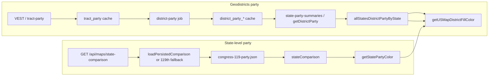

# Maps party data not showing on production – diagnosis and fixes

## Data flow summary

- **State shading (e.g. state outline, fallback for districts):** Comes from `GET /api/maps/state-comparison`. Backend uses [backend/services/congress-119-party.js](backend/services/congress-119-party.js) and reads [backend/data/congress-119-party.json](backend/data/congress-119-party.json). If no `maps-state-comparison.json` exists, it returns a **119th-only fallback** (congressD/congressR per state; geodistricts 0/0). Frontend stores that in `stateComparison` and uses it in `getStatePartyColor()` and as fallback in `getUSMapDistrictFillColor()` ([maps-page.component.ts](frontend/src/app/pages/maps-page.component.ts) ~4658–4669).
- **Geodistricts (per-district) party:** Comes from district-level party %: backend aggregates from **tract-level party** (VEST-derived) into `district_party_`* cache. Frontend loads that via `GET /api/algorithm/district-party/:state/:step` (and batch in All view) and via `GET /api/maps/state-party-summaries` (which lists `district_party_`* docs). So geodistricts party **depends on** tract-party and district-party being present in the backend cache.

## 1. Geodistricts party on GCP – expected to be missing

**Conclusion: Production not having VEST/tract-party data is the main reason geodistricts party is missing.**

- Tract-party is built from **VEST** (e.g. [backend/services/vest-data-loader.js](backend/services/vest-data-loader.js), [backend/services/tract-party-persistence.js](backend/services/tract-party-persistence.js)). VEST is loaded from local/GCS; the tract-party persistence job is intended to be run **locally** (see [backend/LOCAL_CACHE_CONFIG.md](backend/LOCAL_CACHE_CONFIG.md)).
- On GCP, the Cloud Run backend typically has **no** VEST files, **no** pre-populated `tract_party_`* cache, and therefore **no** `district_party_`* docs. So:
  - `GET /api/maps/state-party-summaries` returns `{ summaries: {} }` (it only aggregates from `district_party_`* docs).
  - `GET /api/algorithm/district-party/:state/:step` returns 404 or “run tract-party-persistence first”.
- So **geodistricts party not showing on production is expected** unless you pre-populate tract-party and district-party in Firestore/GCS (e.g. by running tract-party persistence and district-party jobs and uploading results, or by having a one-off job that does that).

**Options to get geodistricts party on production:**

- **Pre-populate cache:** Run tract-party persistence (and district-party) locally or in a CI/one-off job, then ensure writes go to GCS/Firestore so the production backend reads them ([backend/services/cloud-storage-cache.js](backend/services/cloud-storage-cache.js), [backend/LOCAL_CACHE_CONFIG.md](backend/LOCAL_CACHE_CONFIG.md)).
- **Or** document that geodistricts party is only available when the backend has that cache (e.g. after running the jobs or in a “demo” environment with preloaded data).

## 2. State-level (119th) party on GCP – why it might not show

**State-level party does not depend on VEST.** It only needs:

- `GET /api/maps/state-comparison` to return 200 with the 119th fallback (from [backend/index.js](backend/index.js) ~1166–1194).
- That handler reads [backend/services/congress-119-party.js](backend/services/congress-119-party.js), which uses [getDataPath()](backend/services/congress-119-party.js) and expects the file at `backend/data/congress-119-party.json`. The Dockerfile does `COPY . .` from `backend/` and [backend/.dockerignore](backend/.dockerignore) does **not** exclude `data/`, so the file should be in the image at `/app/data/congress-119-party.json`.

**If state party is still not showing, likely causes:**

1. **state-comparison returns 5xx**
  Then the frontend sets `stateComparison = null` ([maps-page.component.ts](frontend/src/app/pages/maps-page.component.ts) ~328–336, catch returns `of(null)`). So `getStatePartyColor()` has no data and polygons get a neutral/gray color.  
   **Check:** In production, call `GET https://geodistricts-api-288960974559.us-central1.run.app/api/maps/state-comparison` and confirm 200 and a payload with `states[stateCode].congressD/congressR`. If you get 500, inspect Cloud Run logs; a common cause is `congress-119-party.json` missing at runtime (e.g. path or build context issue).
2. **Timing**
  [rerenderUSMapIfAllView()](frontend/src/app/pages/maps-page.component.ts) (lines 1124–1132) only re-renders when `usMapStepDataByState` or `cachedUSMapStepDataByState` has length. If state-comparison completes **after** the first map paint and the first paint used empty polygon data, a second render will only happen when that condition holds. The code already calls `renderUSMapDistricts(this.usMapStepDataByState)` after setting `allStatesDistrictPartyByState` on the All-view load path (lines 1007–1008), so when district data exists, a re-render runs. If state-comparison arrives later, `rerenderUSMapIfAllView()` will only update colors if there is already `usMapStepDataByState`/cached data. So if the very first render happens before state-comparison and with empty data, you might see no (or wrong) colors until a subsequent render. Improving robustness would mean ensuring a re-render when `stateComparison` is set and we are in All view with any polygon data (e.g. call `rerenderUSMapIfAllView()` when state-comparison arrives and we have any state data to draw).
3. **CORS or wrong API URL**
  If the browser cannot reach the API or gets a CORS error, the state-comparison request fails and again `stateComparison` stays null. Confirm [environment.prod.ts](frontend/src/environments/environment.prod.ts) `apiUrl` and that the production backend allows the frontend origin.

## 3. Recommended next steps

1. **Verify state-comparison on production**
  - Open `GET https://geodistricts-api-288960974559.us-central1.run.app/api/maps/state-comparison` (or your actual API URL).  
  - If 200: confirm payload has `states` with `congressD`/`congressR`; then the remaining issue is frontend (timing/CORS/URL).  
  - If 5xx: check Cloud Run logs and confirm `/app/data/congress-119-party.json` exists in the image (e.g. add a small health/debug route that checks `fs.existsSync` and file size).
2. **Optional: robust re-render when state-comparison arrives**
  In [maps-page.component.ts](frontend/src/app/pages/maps-page.component.ts), in the state-comparison subscribe (around 333–336), after setting `this.stateComparison = payload`, call `this.rerenderUSMapIfAllView()` (already there). Ensure `rerenderUSMapIfAllView()` runs a redraw whenever we have any state polygon data to show (e.g. `usMapStepDataByState?.length` or `cachedUSMapStepDataByState?.length`) so that when state-comparison arrives after the initial load, the map updates to 119th colors.
3. **Geodistricts on production**
  Decide whether to: (a) run tract-party (and district-party) and upload results to GCS/Firestore so production can serve district party, or (b) keep geodistricts party as a “when data is available” feature and document that for production it may be empty until cache is populated.

## Summary

| Data type         | Source                                                                                 | On GCP                                                                                              |
| ----------------- | -------------------------------------------------------------------------------------- | --------------------------------------------------------------------------------------------------- |
| **State (119th)** | `GET /api/maps/state-comparison` → congress-119-party.json                             | Should work if file is in image and API returns 200; if not, check 5xx, timing, CORS.               |
| **Geodistricts**  | tract_party (VEST) → district_party cache → state-party-summaries / district-party API | Expected to be missing unless tract-party and district-party caches are populated in Firestore/GCS. |

So: **local** can show both (you have VEST and run tract-party locally). **GCP** often has no VEST/tract-party, so geodistricts party is expected to be absent unless you pre-populate cache; state-level party should work if state-comparison succeeds and the frontend re-renders with it.