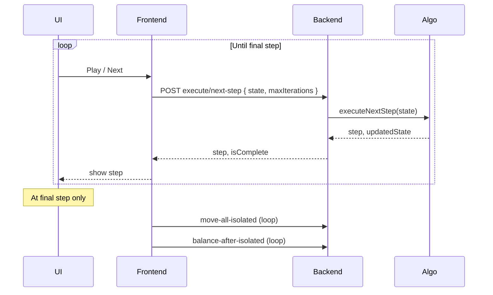

# Move/balance per step checkbox

## Archive search summary

Searched agent transcripts and project archives for prior discussions of **when** to move isolated tracts and balance:

- **Transcripts**: No prior chat was found that explicitly compared "move/balance after each step" vs "move/balance only at final step." The only matching transcript ([149c25aa](agent-transcripts/149c25aa-647f-4b83-b3d7-9b8791fbdf86)) is the same request as this one.
- **Docs/archives**: Existing behavior is documented:
  - [doc/pages/TRACT_ISOLATION_SPEC_AND_IMPLEMENTATION.md](doc/pages/TRACT_ISOLATION_SPEC_AND_IMPLEMENTATION.md) §6b and §8: final-step variance balancing; run-mode strategies `perStep` vs `finalStepOnly` vs `none`.
  - [.cursor/archive/2026-02/260215-move-isolated-no-balance-balance-button.md](.cursor/archive/2026-02/260215-move-isolated-no-balance-balance-button.md): move-all-isolated and balance-after-isolated as separate endpoints.
  - [.cursor/archive/2026-02/260220-final-step-adjacency-move-isolated.md](.cursor/archive/2026-02/260220-final-step-adjacency-move-isolated.md): adjacency-based move at final step; resolveIsolationForFinalStep.
  - [.cursor/archive/2026-02/260224-play-final-step-move-balance.md](.cursor/archive/2026-02/260224-play-final-step-move-balance.md): play runs next-step repeatedly, then at final step runs move isolated then balance.

So the **current** behavior is: play = next-step repeatedly until final step, then run move isolated (loop) and balance (loop) once at the end. The algorithm **already** supports a per-step resolution strategy in the **run-all** path (`executeGeodistrictAlgorithm` with `isolationStrategy === 'perStep'`), but that path is used by scripts (e.g. run-incomplete-states), not by the interactive step-by-step UI. This plan adds the same idea to the **interactive** flow (next-step + optional move/balance after each step).

---

## Current flow (play)

- [frontend/src/app/pages/maps-page.component.ts](frontend/src/app/pages/maps-page.component.ts): `playSteps()` → `nextStep()` or `runFinalStepToCompletion()`; `nextStep()` calls `geodistrictService.executeNextStep(options)` with no move/balance option ([lines 2288–2295](frontend/src/app/pages/maps-page.component.ts)).
- [frontend/src/app/services/geodistrict-algorithm.service.ts](frontend/src/app/services/geodistrict-algorithm.service.ts): `executeNextStep` POSTs to `/api/algorithm/execute/next-step` with `{ state, maxIterations }` only ([lines 591–602](frontend/src/app/services/geodistrict-algorithm.service.ts)).
- [backend/index.js](backend/index.js): next-step handler at [7096](backend/index.js) calls `algorithmService.executeNextStep(algorithmState)`, caches the step and updated state, returns step; no move/balance ([7338–7398](backend/index.js)).

---

## Target behavior (when checkbox checked)

When "Move/balance per step" is checked and the user clicks Play:

- After **each** division step (including the final step), the backend should run:
  1. **Resolve isolation**: move isolated (and bridge) tracts for that step.
  2. **Balance**: sibling-pair balance for non-final steps; variance-based balance at final step (same as current balance-after-isolated).
- Then cache and return the **result after move+balance** so the next next-step continues from that state.

So with the checkbox on, play behaves like "next → move+balance → next → move+balance → … → final step → move+balance (and trigger union polygons / district-party as today)."

---

## Implementation plan

### 1. Backend: optional move/balance in next-step

**File:** [backend/index.js](backend/index.js)

- In `POST /api/algorithm/execute/next-step`, read `options.moveBalanceAfterStep === true` from the request body (with `options = {}` default).
- **After** `executeNextStep(algorithmState)` returns (we have `step`, `updatedState`, `isComplete`), if `moveBalanceAfterStep && nextStepNumber > 0`:
  - Build `allTracts` from `step.districtGroups` (flatten `censusTracts`; use `getTractId` from geodistrict-algorithm).
  - Derive **step0IslandTractIds**: from `updatedState.steps[0].islandTractsData` (same structure as in [geodistrict-algorithm.js](backend/services/geodistrict-algorithm.js) lines 2177–2196). If missing (e.g. rehydrated state), try step 0 cache or pass `null`.
  - **If final step** (all groups single-district):
    - Call `algorithmService.resolveIsolationForFinalStep(groups, allTracts, step0IslandTractIds, nextStepNumber)` then variance balance (same logic as in `POST /api/algorithm/balance-after-isolated` final-step branch: `balanceDistrictsByVariance`, optional resolve-isolated loop and second/third balance). Use the same improvement threshold and step0IslandSet handling.
    - Mark step complete and trigger build-all-union-polygons and district-party (same as current balance-after-isolated and next-step cache path).
  - **Else** (non-final step):
    - Call `algorithmService.resolveIsolationForStep(groups, allTracts, step.divisionLines, step0IslandTractIds, nextStepNumber)`.
    - Call `algorithmService.balanceSiblingPairsAfterIsolatedMoves(updatedGroups, allTracts, step.divisionLines)`.
  - Replace `step.districtGroups` with the result; replace `updatedState.currentGroups` and (if applicable) the step in `updatedState.steps[nextStepNumber]` with the same result so cached state is consistent.
- Cache the step (and algorithm state) with the **move/balance result** (same `setStepCache` / `cacheAlgorithmState` as today).
- Return the updated step and `isComplete` as today.

**Reuse:** Logic in [backend/index.js](backend/index.js) for balance-after-isolated (lines 9962–10051: final-step variance balance + resolve-isolated loop) and [backend/services/geodistrict-algorithm.js](backend/services/geodistrict-algorithm.js) `resolveIsolationForStep`, `resolveIsolationForFinalStep`, `balanceSiblingPairsAfterIsolatedMoves`, `balanceDistrictsByVariance`.

**Edge cases:** If resolve or balance throws, log and return the step without move/balance (do not fail the whole request). When reading from cache and `moveBalanceAfterStep` is true, do **not** re-run move/balance (cache already contains the result from the run that had the option set); only apply move/balance when **executing** the step (cache miss).

### 2. Frontend: checkbox and option passing

**Checkbox placement and binding**

- Add a checkbox **"Move/balance per step"** in the step-control area. Logical place: same row or just below the step button bar in [frontend/src/app/pages/maps-page.component.html](frontend/src/app/pages/maps-page.component.html) (e.g. inside the same `info-header-step-bar` div as `app-step-btn-bar`), or optionally on the step bar component.
- Use a **signal** (e.g. `moveBalancePerStep = signal(false)`) in [frontend/src/app/pages/maps-page.component.ts](frontend/src/app/pages/maps-page.component.ts) and bind the checkbox with `ngModel` or `(change)` to that signal (or a writable that updates it). Per project rules, prefer signals for reactive UI state.
- Show the checkbox only in **admin/dev** mode (e.g. when `isDevMode` or when step bar variant is `'admin'`), since step-by-step execution is dev-only.

**Pass option when executing next step**

- When calling `executeNextStep`, pass the checkbox state in options: `options.moveBalanceAfterStep = this.moveBalancePerStep()` (or the signal’s value).
- In [frontend/src/app/services/geodistrict-algorithm.service.ts](frontend/src/app/services/geodistrict-algorithm.service.ts), extend the request body to include `options: { moveBalanceAfterStep: true }` when the caller provides it (e.g. accept `options?: { moveBalanceAfterStep?: boolean }` in a method option or via `GeodistrictOptions` and send it in the POST body).

**Types**

- If [GeodistrictOptions](frontend/src/app/services/geodistrict-algorithm.service.ts) (or the type used for executeNextStep) does not include `moveBalanceAfterStep`, add an optional `moveBalanceAfterStep?: boolean`.

### 3. Step button bar (optional)

- If the checkbox is placed **inside** [frontend/src/app/components/step-btn-bar.component.ts](frontend/src/app/components/step-btn-bar.component.ts), add an `@Input() moveBalancePerStep: boolean` and `@Output() moveBalancePerStepChange` (or use a callback) so the parent can two-way bind, and the parent passes the option when calling the algorithm service. Alternatively, keep the checkbox in the parent (maps-page) and only pass the boolean into the service; no change to step-btn-bar API required.

### 4. Documentation

- Update [doc/pages/TRACT_ISOLATION_SPEC_AND_IMPLEMENTATION.md](doc/pages/TRACT_ISOLATION_SPEC_AND_IMPLEMENTATION.md) (e.g. §8 or "Step mode") to note that in step-by-step (dev) UI, a "Move/balance per step" option can be enabled so that when the user clicks Play, each division step is followed by resolve-isolation and balance (sibling-pair or variance at final step), matching the per-step strategy of the run-all flow.

---

## Summary of files to touch

| Area     | File                                                                                                                     | Change                                                                                                                                                                                                                                                    |
| -------- | ------------------------------------------------------------------------------------------------------------------------ | --------------------------------------------------------------------------------------------------------------------------------------------------------------------------------------------------------------------------------------------------------- |
| Backend  | [backend/index.js](backend/index.js)                                                                                     | In next-step handler: read `options.moveBalanceAfterStep`; after executeNextStep, when option set and step > 0, run resolve (ForStep or ForFinalStep) + balance; update step and state, then cache and respond. On cache hit, do not re-run move/balance. |
| Frontend | [frontend/src/app/pages/maps-page.component.ts](frontend/src/app/pages/maps-page.component.ts)                           | Add `moveBalancePerStep` signal; pass it as `options.moveBalanceAfterStep` when calling executeNextStep.                                                                                                                                                  |
| Frontend | [frontend/src/app/pages/maps-page.component.html](frontend/src/app/pages/maps-page.component.html)                       | Add checkbox "Move/balance per step" (dev only), bound to moveBalancePerStep.                                                                                                                                                                             |
| Frontend | [frontend/src/app/services/geodistrict-algorithm.service.ts](frontend/src/app/services/geodistrict-algorithm.service.ts) | executeNextStep: accept and send `options.moveBalanceAfterStep` in POST body; extend GeodistrictOptions if needed.                                                                                                                                        |
| Doc      | [doc/pages/TRACT_ISOLATION_SPEC_AND_IMPLEMENTATION.md](doc/pages/TRACT_ISOLATION_SPEC_AND_IMPLEMENTATION.md)             | Short note on step-mode "Move/balance per step" option and Play behavior.                                                                                                                                                                                 |

No change to the algorithm service’s `executeNextStep(algorithmState)` signature; move/balance is orchestrated in the HTTP handler only.