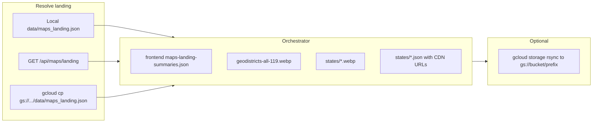

# Static maps CDN: one-shot build + upload script

## Context

Today the pipeline is documented in [doc/pages/STATIC_MAPS_CDN.md](doc/pages/STATIC_MAPS_CDN.md) but split across several commands:


| Step                                | Script                                                                                                                 | Output                                                                                               |
| ----------------------------------- | ---------------------------------------------------------------------------------------------------------------------- | ---------------------------------------------------------------------------------------------------- |
| Summaries (no polygons)             | [backend/scripts/generate-frontend-maps-summaries.js](backend/scripts/generate-frontend-maps-summaries.js)             | [frontend/public/maps/maps-landing-summaries.json](frontend/public/maps/maps-landing-summaries.json) |
| National WebP                       | [backend/scripts/generate-geodistricts-all-raster.js](backend/scripts/generate-geodistricts-all-raster.js)             | e.g. `geodistricts-all-119.webp`                                                                     |
| Per-state WebP                      | [backend/scripts/generate-state-map-rasters.js](backend/scripts/generate-state-map-rasters.js)                         | `data/static-states/states/*.webp` (paths relative to chosen base)                                   |
| Per-state JSON + `stateMapImageUrl` | [backend/scripts/generate-state-static-json.js](backend/scripts/generate-state-static-json.js) + `CDN_PUBLIC_BASE_URL` | same `states/*.json`                                                                                 |


**Input dependency:** all generators need a full `maps_landing` JSON (`polygonsByState`, `districtPartyByState`, `stateComparison`, …). That blob normally lives in GCS as `data/maps_landing.json` ([cloud-storage-cache.js](backend/services/cloud-storage-cache.js) key `maps_landing`, bucket default `CENSUS_DATA_BUCKET` / `geodistricts-census-data`). It is **not** committed to git.




## Implementation

### 1. New script: `backend/scripts/build-static-maps-cdn-assets.js`

Single Node entrypoint (repo root as `cwd` when invoked via `npm`/`node` from root—match [launch.json](.vscode/launch.json) convention).

**Behavior:**

- **Output directory** (default `data/cdn-maps-static`, overridable via `OUT_DIR` or `--out`):  
  - `geodistricts-all-119.webp`  
  - `states/*.webp` and `states/*.json` (same layout as today’s docs)  
  - Optionally symlink logic: summaries still written by existing script into `frontend/public/maps/` (or orchestrator shells the existing script unchanged).
- **Resolve landing** (first successful wins, configurable via flags):  
  1. Use `--landing` path if provided and file exists.
  2. Else if `data/maps_landing.json` exists (optional `--require-fresh` skip).
  3. Else if `GET_MAPS_LANDING_URL` or `--from-api <base>`: `GET {base}/api/maps/landing` (axios, long timeout); write atomically to `data/maps_landing.json` or a temp file under `OUT_DIR` and pass path to children.
  4. Else if `--from-gcs` or env `MAPS_LANDING_GCS_URI` (e.g. `gs://geodistricts-census-data/data/maps_landing.json`): spawn `gcloud storage cp` (or document fallback `gsutil cp`) to `data/maps_landing.json`.
  5. If still missing: exit with clear message listing options (admin generate, [sync-maps-to-gcs.js](backend/scripts/sync-maps-to-gcs.js), local file).
- **Run pipeline** in order via `child_process.spawnSync` with `stdio: 'inherit'` and repo-root `cwd`:  
  1. `node backend/scripts/generate-frontend-maps-summaries.js <landingPath>`
  2. `node backend/scripts/generate-geodistricts-all-raster.js <landingPath> <out>/geodistricts-all-119.webp`
  3. `node backend/scripts/generate-state-map-rasters.js <landingPath> <out>` (script already writes `<out>/states/*.webp`)
  4. `CDN_PUBLIC_BASE_URL=<STATIC_MAPS_CDN_BASE> node backend/scripts/generate-state-static-json.js <landingPath> <out>`
  `STATIC_MAPS_CDN_BASE` is required for step 4 (no fake default): must be the **HTTPS base** the browser will use (e.g. `https://storage.googleapis.com/BUCKET_NAME/public-maps` or a Cloud CDN URL). Validate trailing-slash stripping.
- **Optional upload** (`--upload`):  
  - Env `STATIC_MAPS_GCS_PREFIX` e.g. `gs://geodistricts-census-data/public-maps` (distinct prefix from `data/maps_landing.json` so uploads never overwrite the API’s internal cache file).  
  - Run `gcloud storage rsync` (or `cp -r`) from `OUT_DIR` to that prefix with `--cache-control="public, max-age=86400"` (and optionally content-type for `.json` / `.webp` if needed).  
  - If `gcloud` missing or non-zero exit, print instructions instead of failing silent.
- **Dry-run** (`--dry-run`): print commands only.

### 2. Root `package.json` script

Add something like:  
`"build:static-maps-cdn": "node backend/scripts/build-static-maps-cdn-assets.js"`  
so `npm run build:static-maps-cdn -- --upload` works from repo root.

### 3. Documentation

Extend [doc/pages/STATIC_MAPS_CDN.md](doc/pages/STATIC_MAPS_CDN.md):

- **One command** section with examples: local landing, fetch from API, fetch from GCS, upload.  
- **Prerequisites:** `gcloud` CLI, `Application Default Credentials` or user login; bucket exists; **public read** for the static prefix (either bucket/object IAM `allUsers` objectViewer for that bucket—acceptable only if bucket is dedicated to public assets—or use a separate public bucket; alternatively Load Balancer + CDN backend bucket—then `STATIC_MAPS_CDN_BASE` is the CDN URL).  
- **Frontend:** after upload, set `cdnBaseUrl` / `staticAllMapImageUrl` in [frontend/src/environments/environment.prod.ts](frontend/src/environments/environment.prod.ts) to match `STATIC_MAPS_CDN_BASE` (script can echo exact values).

### 4. Execution note (after plan approval)

Run from repo root with real credentials, e.g.:

```bash
export STATIC_MAPS_CDN_BASE='https://storage.googleapis.com/YOUR_BUCKET/public-maps'
export MAPS_LANDING_GCS_URI='gs://geodistricts-census-data/data/maps_landing.json'  # if no local/API
npm run build:static-maps-cdn -- --from-gcs --upload
```

If production `GET /api/maps/landing` returns 404, landing must be produced first (e.g. authenticated `POST /api/admin/maps-landing/generate` or [sync-maps-to-gcs.js](backend/scripts/sync-maps-to-gcs.js)—that path hits admin endpoints and is **out of scope** for a fully unauthenticated script; the orchestrator only **consumes** landing).

## Risks / limits

- **Cannot** guarantee CDN is “live” without your bucket IAM / CDN config; the script can upload bytes to GCS but public URL access is a one-time GCP console/IaC step.  
- **Large repo:** `maps_landing.json` can be ~20MB+; fetching and raster generation need RAM/time (Sharp).  
- **Hardcoded production API URLs** in [sync-maps-to-gcs.js](backend/scripts/sync-maps-to-gcs.js) are separate; the new script should prefer env-driven URLs and avoid adding new hardcoded hosts.

