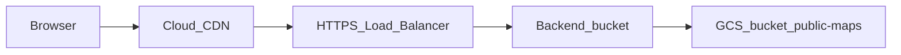

# Static maps with Cloud CDN (provisioned)

## Goal

Serve static map WebP/JSON through **Cloud CDN** (global external HTTPS load balancer + **backend bucket** with CDN enabled). **Provision infrastructure from the repo** via a script under [deploy/](deploy/), not only a hand-run console checklist.

## Architecture (unchanged)

## URL contract (unchanged)

- Objects: `gs://STATIC_MAPS_BUCKET/public-maps/...` (same as [doc/pages/STATIC_MAPS_CDN.md](doc/pages/STATIC_MAPS_CDN.md)).
- `**STATIC_MAPS_CDN_BASE**`: `https://<CDN_HOSTNAME>/public-maps` (no trailing slash).
- `**STATIC_MAPS_GCS_PREFIX**`: `gs://STATIC_MAPS_BUCKET/public-maps` (upload only; not the LB URL).

## Provisioning deliverable (repo)

Add `**deploy/static-maps-cdn/**`:

| File           | Purpose                                                                                                                                                                                                                                                                                                                                                                                                                                     |
| -------------- | ------------------------------------------------------------------------------------------------------------------------------------------------------------------------------------------------------------------------------------------------------------------------------------------------------------------------------------------------------------------------------------------------------------------------------------------- |
| `README.md`    | Prerequisites (`gcloud` auth, roles: compute admin, storage admin, or custom), required env vars, order of operations, DNS step, troubleshooting (cert provisioning, 403 from bucket IAM).                                                                                                                                                                                                                                                  |
| `provision.sh` | **Idempotent where `gcloud` supports it**: create or update backend bucket on `STATIC_MAPS_BUCKET` with `**--enable-cdn`**, default URL map pointing at that backend bucket, Google-managed SSL cert for `CDN_HOSTNAME`, target HTTPS proxy, global static IP, global HTTPS forwarding rule. Use consistent resource name prefix (e.g. `geodistricts-static-maps-*`) parameterized by env. Fail fast with clear messages if bucket missing. |

**Implementation notes for the script** (follow current GCP docs when coding; APIs and flag names drift):

- Use `**gcloud compute backend-buckets`** with `**--enable-cdn`** (and appropriate cache policy flags if needed beyond origin `Cache-Control`).
- URL map **default backend** must be the backend bucket so paths like `/public-maps/states/CA.webp` map to object key `public-maps/states/CA.webp`.
- Reserve `**gcloud compute addresses create`** (global) and print it for DNS.
- **Managed certificate**: `gcloud compute ssl-certificates create` (managed) for `CDN_HOSTNAME`; README must state DNS must point to the LB IP **before** cert becomes ACTIVE (chicken-and-egg: often add DNS to provisional IP from first run, then re-check cert).
- **DNS**: script does not need to mutate Cloud DNS unless you choose to add optional `gcloud dns` commands; minimum is documenting an **A/AAAA record** to the reserved IP.
- **IAM**: README documents bucket access for the load balancer (per [backend bucket](https://cloud.google.com/load-balancing/docs/backend-bucket)) and whether objects need `allUsers:objectViewer` for anonymous web or org-specific alternatives—align with security review.

**Optional later**: duplicate the same topology in Terraform under `deploy/terraform/static-maps-cdn/` if the team standardizes on IaC; initial plan targets `**gcloud` shell** to match lightweight [deploy/cloud-run.yaml](deploy/cloud-run.yaml) style and avoid new toolchain.

## Execution order

1. Create `**STATIC_MAPS_BUCKET`** (if new) and enable uniform access as required by backend buckets.
2. **Upload** objects (existing pipeline): `STATIC_MAPS_GCS_PREFIX`, `npm run build:static-maps-cdn -- --upload` (after `maps_landing` resolved).
3. Run `**deploy/static-maps-cdn/provision.sh`** with `PROJECT_ID`, `STATIC_MAPS_BUCKET`, `CDN_HOSTNAME`.
4. **DNS**: point `CDN_HOSTNAME` at the printed global IP; wait for managed cert.
5. **Rebuild** with `STATIC_MAPS_CDN_BASE=https://CDN_HOSTNAME/public-maps`, re-upload if JSON URLs must be absolute at new host.
6. Set `**cdnBaseUrl`** in [frontend/src/environments/environment.prod.ts](frontend/src/environments/environment.prod.ts) and deploy frontend.

## After URL or asset changes

Document `**gcloud compute url-maps invalidate-cdn-cache`** (or successor) in README for operators when replacing objects under immutable URLs or shortening TTL is insufficient.

## Documentation

Update [doc/pages/STATIC_MAPS_CDN.md](doc/pages/STATIC_MAPS_CDN.md) with a **“Cloud CDN (provisioned load balancer)”** subsection: link to `deploy/static-maps-cdn/`, env vars, and the distinction between `gs://` upload prefix and `https://` browser base.