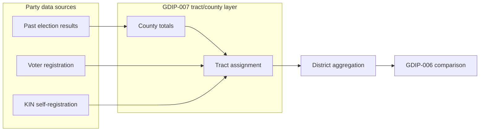

# Step 2 map fixes, party totals, and GDIP-007

## 1. Bug: Step 2 map shows tracts shaded red with "Show tracts" off

**Cause:** In [frontend/src/app/pages/maps-page.component.ts](frontend/src/app/pages/maps-page.component.ts), when rendering individual tracts (e.g. at step 2 when no union polygons exist), fill color is decided by:

```3970:3971:frontend/src/app/pages/maps-page.component.ts
const useDistrictPartyColor = this.showPartyColor && this.districtPartyByGroupKey?.[groupKey];
const useTractPartyColor = (this.showTractBoundaries || this.showPartyColor) && partyData && !useDistrictPartyColor;
```

When **show tracts** is off but **show party color** is on, and district-level party is missing for the current step’s group keys (e.g. at step 2 we have groups "1-10", "11-19" while `districtPartyByGroupKey` only has final-step keys "1-1" … "38-38"), `useTractPartyColor` becomes true and each tract is colored by its own party (red/blue). So tract boundaries are effectively “off” but tract-level party shading is still applied.

**Fix:** Only use tract-level party color when tract boundaries are shown. Require `showTractBoundaries` for tract party coloring:

- Change to: `useTractPartyColor = this.showTractBoundaries && partyData && !useDistrictPartyColor` (or equivalent: only allow tract party color when `showTractBoundaries` is true).
- When `showTractBoundaries` is false, use one color per district: district party color if `districtPartyByGroupKey[groupKey]` exists, else district index color (`getDistrictColor`). No per-tract party shading.

**Location:** Same file, ~line 3971.

---

## 2. Bug: Party totals incorrect (e.g. Districts 1–10, 11–19, … D/R % wrong)

**Possible causes:**

- **Intermediate-step table vs final-step data:** The district table shows `currentStep.districtGroups` (at step 2: "1-10", "11-19", "20-29", "30-38"). Party comes from `districtPartyByGroupKey`, which is loaded only for the **final** step via `fetchDistrictPartyForCurrentStep()` and has keys "1-1", "2-2", … "38-38". So `getGroupPartyDisplayText(group)` does `districtPartyByGroupKey["1-10"]` and gets `undefined` → "–". If the user is instead seeing wrong numbers (e.g. D 24.7% · R 27.2%), then either:
  - The UI is at the **final** step and the wrong numbers are a different bug (e.g. wrong doc selected, or two-party vs total-votes denominator), or
  - There is another code path that fills party for range groups (e.g. from per-group API or aggregation) that is incorrect.

**Planned fixes:**

- **Two-party denominator:** Already addressed in backend (see [.cursor/archive/2026-03/2026-03-02/260302-tx-party-data-two-party-calc.md](.cursor/archive/2026-03/2026-03-02/260302-tx-party-data-two-party-calc.md)): district aggregation uses `twoPartyTotal = votesDem + votesRep` and `pctDem = votesDem / twoPartyTotal`. Confirm tract-party persistence and `buildTractDataFromCountyVEST` store `total_votes_pres = dem + rep` so tract data is two-party consistent; verify no remaining use of full ballot total as denominator.
- **State/doc selection:** Backend [backend/index.js](backend/index.js) `GET /api/maps/state-party-summaries` prefers a doc whose district count matches the state’s expected districts (see [.cursor/archive/2026-03/2026-03-03/260303-oh-us-party-totals-fixes.md](.cursor/archive/2026-03/2026-03-03/260303-oh-us-party-totals-fixes.md)). Ensure single-state district party fetch also uses the correct final-step doc (by step and district count).
- **Optional UX improvement:** For intermediate steps, when `districtPartyByGroupKey` has only single-district keys (e.g. "1-1" … "38-38"), aggregate votes for range groups (e.g. "1-10" = sum of "1-1" through "10-10") so the table shows approximate D/R % for "Districts 1-10", etc. This is display-only aggregation in the frontend; backend stays final-step only.

---

## 3. Tract-level party: compute once per VEST refresh / year; county fallback

**Requirement:** Party totals by tract should be computed **once** after:

- Any refresh of VEST data, or
- When the election year is changed.

VEST is tracked/totalled by county; tracts lie within counties. So when only county-level VEST is available, assign each census tract the same party percentages (and proportional vote counts) as its parent county. This is an approximation (actual tract results can differ, especially with urban/rural splits).

**Implementation direction:**

- **Backend:** Tract-party persistence job (e.g. `runTractPartyPersistenceJob`) already builds tract-level data from county VEST via [backend/services/vest-data-loader.js](backend/services/vest-data-loader.js) `buildTractDataFromCountyVEST`. Ensure:
  - Tract party is cached by (state, year) and only recomputed when VEST data for that year is refreshed or year changes (invalidate or version cache key by VEST source/timestamp/year).
  - County → tract assignment is by GEOID (state+county FIPS); allocation is proportional by tract count per county or equal split when no tract-level votes exist.
- **Frontend:** No need to recalc tract party on every step load; use cached tract party from API. District party job already aggregates from tract party; it should run after tract party is available and when final step is ready.

**Protocol recommendation (for GDIP-007):** Advocate that election results be reported at census tract level for tracts with population above a threshold (e.g. 100) or similar that preserves anonymity, so that implementations can use tract-level data instead of county approximation where available.

---

## 4. New GDIP-007: Party comparison and tract/county party calculations

**File to add:** [gdip/GDIPs/gdip-007-party-comparison.md](gdip/GDIPs/gdip-007-party-comparison.md)

**Content outline:**

- **Title:** GDIP-007: Party comparison and tract/county party calculations (or similar).
- **Status/Type:** Draft; required or optional as you prefer (tract/county calculation is the baseline any party provider needs).
- **Summary:** Specifies how to compute and aggregate party (D/R) at census tract and county level, and how that feeds district-level party metrics. Defines the **tract/county party calculation** that any party data provider must support; lists **options** for the source of party data.
- **Motivation:** Consistent party metrics across implementations; support for different data sources (election results, registration, KIN).
- **Specification:**
  - **Tract/county party calculations (required for any provider):**
    - Tract-level: When data is tract-level, use it directly; when only county-level is available, assign each tract the same party share (or proportional vote allocation) as its parent county (by state+county FIPS from GEOID).
    - District-level: Sum tract-level votes (or county-allocated tract votes) for tracts in the district; report two-party (D+R) share and percentages. Denominator for percentages: two-party total (D+R), not full ballot total.
    - Cache tract-level party by (state, year); recompute when VEST (or other source) is refreshed or year changes.
  - **Options for source of party data** (protocol lists these; they may become separate GDIPs later):
    1. **Past election results (per election, per county):** e.g. VEST county/tract files. Tract-level when available; otherwise county → tract allocation. Approximation.
    2. **Voter registration (by county / zip / tract):** Better where available (registration by geography). Aggregate to tract then to district.
    3. **KIN (Known Identity Network):** Multi-factor auth, HITL vouching, AI faction/fraud detection; self-registration of party. Most accurate but initially small coverage. Protocol can reference as future option.
  - **Protocol stance:** Advocate reporting election results at census tract level for tracts above a population threshold (e.g. 100) to preserve anonymity and improve accuracy.
- **Relationship to other GDIPs:** GDIP-005 (demographics), GDIP-006 (comparison metrics). GDIP-007 focuses on how party is computed at tract/county and what data sources are in scope; comparison (existing vs geodistricts) can use this for partisan balance.

**Format:** Follow [gdip/GDIPs/gdip-005-demographics.md](gdip/GDIPs/gdip-005-demographics.md) and [gdip/GDIPs/gdip-006-comparison-metrics.md](gdip/GDIPs/gdip-006-comparison-metrics.md) (Status, Type, Summary, Motivation, Specification, References).

---

## 5. Diagram (optional)




---

## Implementation order (suggested)

1. **Map fix:** Require `showTractBoundaries` for tract party color in [maps-page.component.ts](frontend/src/app/pages/maps-page.component.ts) (~line 3971).
2. **Party totals:** Verify two-party denominator and tract cache keys; add optional frontend aggregation for intermediate-step group keys from final-step district party.
3. **Tract party caching:** Ensure tract-party persistence and cache invalidation are keyed by VEST refresh/year (backend).
4. **GDIP-007:** Add [gdip/GDIPs/gdip-007-party-comparison.md](gdip/GDIPs/gdip-007-party-comparison.md) with the structure above.

