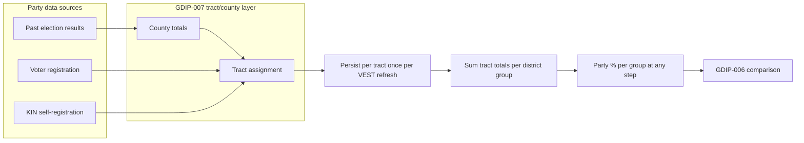

# Step 2 map fixes, party totals, and GDIP-007 (updated)

## 1. Map coloring rules (fix bug + specify behavior)

**Current bug:** With "Show tracts" off, tracts were sometimes colored by tract-level party (red/blue) instead of by district group. Fix by following the rules below.

**Specified behavior:**

- **When "Show tracts" is ON:** Color each tract polygon using the **tract party percentage** stored with that tract (the value based on parent county, from persisted tract-level party data). So each tract is shaded by its own D/R share.
- **When "Show tracts" is OFF:**
  - **If union polygon(s) are available** for the district group: Show the **union polygon(s)** only (no per-tract outlines). Color the union by **district group (DG) party totals** (aggregated D/R % for that group).
  - **If no union polygon is available:** Still show **tract polygons** (individual tract boundaries), but color each tract by **DG color** — i.e. one color per district group. All tracts in the same DG use the same color (DG party color if available, else DG index color). Do not use tract-level party for fill when show tracts is off.

**Summary table:**

| Show tracts | Union polygon available? | What to draw     | Fill color source                          |
| ----------- | ------------------------ | ---------------- | ------------------------------------------ |
| ON          | n/a                      | Tract polygons   | Tract party % (stored, from parent county) |
| OFF         | Yes                      | Union polygon(s) | DG party totals                            |
| OFF         | No                       | Tract polygons   | DG color (one color per group)             |

**Implementation:** [frontend/src/app/pages/maps-page.component.ts](frontend/src/app/pages/maps-page.component.ts): (1) Use tract party color only when `showTractBoundaries === true`. (2) When show tracts is off and union exists, render union with DG party color (already largely in place). (3) When show tracts is off and no union, render tract polygons with DG color only — no tract-level party shading. Key location: ~~line 3971 (`useTractPartyColor`) and the branch that chooses union vs tract rendering (~~3877–3930).

---

## 2. Tract-level party: once per VEST refresh, persisted per tract

**Requirement:** Party data is calculated **once** per VEST (or party data) refresh (or when year changes) and **stored/persisted with each census tract**:

- **Source:** County-level percentages (or ratio in rare cases where tracts span counties). When only county-level VEST is available, each tract is assigned party using its parent county’s percentages (or a ratio for cross-county tracts).
- **Persistence:** Tract-level party (e.g. votes Dem, votes Rep, two-party total or percentages) is cached/persisted keyed by tract GEOID and (state, year). No recomputation until VEST (or source) is refreshed or year changes.

---

## 3. District group party at every step: fast aggregation from tract totals

**Requirement:** Every **district group at each step** can have party data calculated. Because tract-level party is now computed once and persisted per tract:

- **Calculation:** District group party percentages are derived by **summing the already-stored party totals (votes Dem, votes Rep) over the tracts in that group**. Two-party percentages: `pctDem = sum(votesDem) / (sum(votesDem) + sum(votesRep))`, same for `pctRep`.
- **Performance:** This is a **very fast** operation: a single pass over the tract IDs in the group, summing precomputed tract totals. No need to recompute tract party at step or district level.
- **Scope:** Applies at **any step** (step 0, 1, 2, … final). For each district group at that step, the backend (or client if it has tract party and group membership) can aggregate tract totals to get group-level D/R % and vote counts.

**Implementation implications:**

- Backend: When returning a step (or when UI requests party for a group), compute group party by summing `tractParty[geoid].votesDem` and `tractParty[geoid].votesRep` for all tract GEOIDs in that group. Cache district-party by (state, step, …) only if desired for speed; otherwise compute on demand from tract party.
- Frontend: For the district table at any step, party column can show D/R % for each group (e.g. "1-10", "11-19", …) by either (a) requesting party per group or per step from the API, or (b) if tract party and group tract lists are available, aggregating in the client.

---

## 4. Bug: Party totals incorrect (e.g. Districts 1–10, 11–19, … D/R % wrong)

**Possible causes:** Wrong doc selected for state; two-party vs total-votes denominator; or at intermediate steps, group keys (e.g. "1-10") not present in a final-step-only doc.

**Planned fixes:**

- **Two-party denominator:** Keep using `twoPartyTotal = votesDem + votesRep` for percentages; ensure tract persistence stores two-party-consistent totals.
- **State/doc selection:** Ensure the correct final-step doc is used when fetching district party for a state.
- **All steps:** With tract-level party persisted and group-party = sum over tracts, support computing (and displaying) party for every district group at every step, not only the final step.

---

## 5. New GDIP-007: Party comparison and tract/county party calculations

**File to add:** [gdip/GDIPs/gdip-007-party-comparison.md](gdip/GDIPs/gdip-007-party-comparison.md)

**Content outline:**

- **Title:** GDIP-007: Party comparison and tract/county party calculations.
- **Summary:** Specifies tract/county party calculation (required for any party data provider) and that **district group party at any step** is computed by aggregating persisted tract-level party totals. Lists options for data sources (election results, voter registration, KIN).
- **Tract/county (required for any provider):**
  - Tract-level: Computed once per VEST (or source) refresh or year change; persisted per tract using county percentages (or ratio where tracts span counties).
  - District group at any step: Party percentages and totals are obtained by **summing stored tract-level party totals** over the tracts in that group — a fast aggregation step.
- **Options for source:** Past election results (per election, per county); voter registration (county/zip/tract); KIN-based self-registration. Protocol advocates tract-level election reporting where anonymity allows (e.g. population threshold).

---

## 6. Diagram

---

## Implementation order (suggested)

1. **Map coloring rules:** Implement the table above in [maps-page.component.ts](frontend/src/app/pages/maps-page.component.ts): tract party % only when show tracts ON; when OFF, union polygon with DG party totals if available, else tract polygons with DG color (~line 3971 and union vs tract branch ~3877–3930).
2. **Tract party:** Ensure tract-party is computed once per VEST refresh/year and persisted per tract (county % or ratio for cross-county); cache key by (state, year) and invalidate on refresh/year change.
3. **District group party at any step:** Add (or reuse) API that, for a given (state, step, groupKey), returns party by summing persisted tract totals for that group’s tracts; use same logic for final step. Ensure UI can request/display party for every group at every step.
4. **Party totals bug:** Verify two-party denominator and correct doc selection; rely on tract aggregation for correct totals.
5. **GDIP-007:** Add [gdip/GDIPs/gdip-007-party-comparison.md](gdip/GDIPs/gdip-007-party-comparison.md) with tract/county rules and “any step, any group” aggregation from tract totals.

