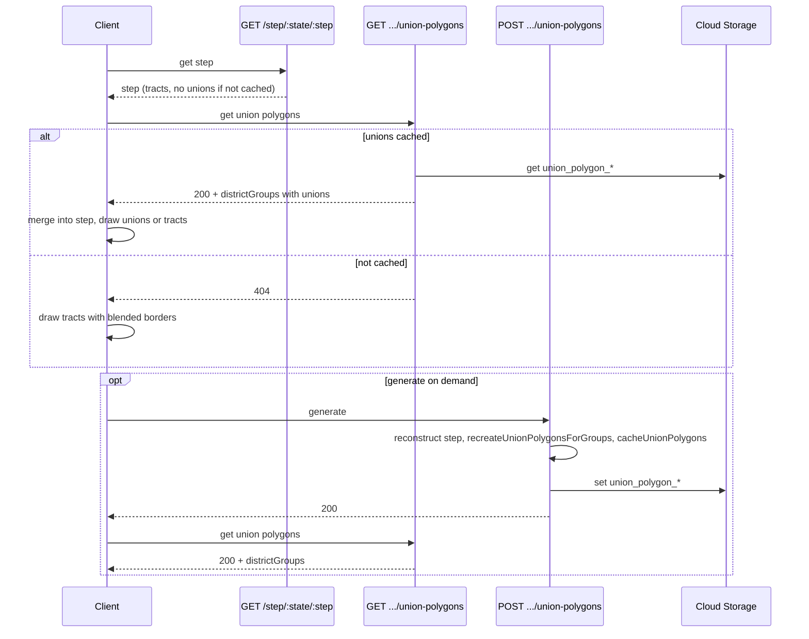

# Step Union Polygons API and Client Defaults

## Current behavior

- Union polygons are created only when a step is **completed** during algorithm run (e.g. next-step or run-all). They are built via `recreateUnionPolygonsForGroups()` and stored with `cacheUnionPolygons()` in [backend/index.js](backend/index.js) (Cloud Storage + Firestore metadata). Cache keys: `union_polygon_{state}_{step}_{startDistrictNumber}-{endDistrictNumber}`; path in bucket: `union-polygons/{state}/step-{step}/{key}.json` per [backend/services/cloud-storage-cache.js](backend/services/cloud-storage-cache.js).
- GET step ([backend/index.js](backend/index.js) `GET /api/algorithm/step/:state/:stepNumber`) loads step from Firestore/Cloud Storage and, when `unionPolygonsCached === true`, calls `loadUnionPolygonsFromCache()` inside `reconstructStepFromCache()` so the response includes inlined union polygons.
- Frontend [maps-page.component.ts](frontend/src/app/pages/maps-page.component.ts): when `showTractBoundaries` is false it renders union polygons if present; if union is missing it **skips** rendering that district (warning and return), so the district disappears.

## Backend changes

### 1. POST endpoint: generate and store union polygons for a step

- **Route:** `POST /api/algorithm/step/:state/:stepNumber/union-polygons` with optional query `maxIterations` (default 100).
- **Behavior:**
  - Validate `state` and `stepNumber`. Reject **step 0** (Step 0 uses TIGER state boundaries only; no tract-based union generation).
  - Resolve step from cache (same as GET step): try `algorithm_step_{state}_{maxIterations}_{stepNumber}`, then `step_{state}_{stepNumber}_{version}`; use `resolveStepCacheEntry()` if doc points to Cloud Storage.
  - If step not found or invalid, return `404` with a clear error.
  - Reconstruct step with tract geometries if stored in normalized form (same logic as GET step: load state tract cache, `reconstructStepFromCache(..., false, state)` to avoid loading unions, then we build them).
  - Call existing `recreateUnionPolygonsForGroups(stepData.districtGroups, ...)` (and pass `stepNumber`, state total tract count for precision reduction).
  - Call existing `cacheUnionPolygons(state, stepNumber, stepData.districtGroups)` to write each DG’s union to Cloud Storage and Firestore metadata.
  - Update the **step cache** so future GET step and GET union-polygons see unions: re-read full step cache (resolve if in Cloud Storage), set `unionPolygonsCached: true` and add `unionPolygonCacheKey` to each group in `stepData.districtGroups`, then write back with `setStepCache(stepCacheKey, updatedCacheData)`. Use the same `stepCacheKey` that was used to load the step (algorithm_step_ or step_).
  - Return **200** with body e.g. `{ ok: true, message: 'Union polygons generated and cached', state, step: stepNumber }`.
- **Long-running:** Run synchronously; no job queue. Document that clients should use a long timeout (e.g. 5 minutes) for large states. Optionally add a short response header or body field indicating that the operation may be slow.

### 2. GET endpoint: request step DG union polygons

- **Route:** `GET /api/algorithm/step/:state/:stepNumber/union-polygons` with optional query `maxIterations` (default 100).
- **Behavior:**
  - Resolve step cache (same keys as GET step: `algorithm_step`_ then `step`_, and `resolveStepCacheEntry()` for Cloud Storage).
  - If no cached step or `cachedEntry.unionPolygonsCached !== true`, return **404** (no body or minimal `{ error: 'Union polygons not available for this step' }`).
  - Build list of district groups (from `cachedEntry.stepData.districtGroups` or equivalent after resolve) with at least `startDistrictNumber`, `endDistrictNumber`, and `unionPolygonCacheKey` (or derive key as `union_polygon_{state}_{step}_{start}-{end}`).
  - Load union data from Cloud Storage via existing `cloudStorageCache.get(unionCacheKey)` (or reuse `loadUnionPolygonsFromCache()` by passing groups and then returning the loaded groups).
  - Return **200** with a JSON body the client can merge into step data, e.g.  
  `{ districtGroups: [ { startDistrictNumber, endDistrictNumber, unionPolygon, unionPolygons } ] }`  
  (only fields needed for rendering; no need to resend tracts).

## Frontend changes

### 3. Fetch union polygons separately and default to tracts with blended borders

- **Optional fetch:** After a successful `getStep(state, stepNumber)` that returns step data, call the new GET union-polygons endpoint for the same state/step. If **200**, merge the returned `districtGroups` (union fields) into `currentStep.districtGroups` (match by `startDistrictNumber`/`endDistrictNumber`) and call `updateMapLayers()`. If **404**, do nothing (step already has no unions); map will use tracts with blended borders.
- **Default display when unions are missing:** When union polygons are not available for a district, the map must still draw that district. Today, when `showTractBoundaries` is false and there is no union polygon, the code in `renderDistrictGroup` (or equivalent) **returns early** and skips rendering, so the district is invisible. Change this so that when `showTractBoundaries` is false and there is no union polygon (or union polygon list empty), **render individual tracts with blended borders** (same path as “render individual tracts” but with border style: `weight: 0.3`, `color: tractColor` so borders blend with fill). No district should be skipped.
- **Default “show tracts” behavior:** Client defaults to showing individual tracts with blended borders when unions are not available. When unions are available (GET union-polygons returns 200 and data is merged), the existing toggle (e.g. “Show tract boundaries”) can still switch between union view and tract view; when unions are not available, the only option is tracts with blended borders.

### 4. Optional: trigger generation from UI

- Optional: add a control (e.g. in admin or step toolbar) “Generate union polygons for this step” that calls POST union-polygons with a long timeout, then polls GET union-polygons until 200 or a timeout, then merges and refreshes the map. Not required for the minimal plan but improves UX for large states.

## Data flow (high level)

## Files to touch

- **Backend:** [backend/index.js](backend/index.js) — add `POST /api/algorithm/step/:state/:stepNumber/union-polygons` and `GET /api/algorithm/step/:state/:stepNumber/union-polygons`; reuse `recreateUnionPolygonsForGroups`, `cacheUnionPolygons`, `loadUnionPolygonsFromCache`/`cloudStorageCache.get`, `resolveStepCacheEntry`, `setStepCache`, and step cache key logic from existing GET step.
- **Frontend:** [frontend/src/app/pages/maps-page.component.ts](frontend/src/app/pages/maps-page.component.ts) — (1) when `!showTractBoundaries` and no union polygon, render tracts with blended borders instead of skipping; (2) optionally call GET union-polygons after getStep and merge result into `currentStep`; (3) optional “Generate union polygons” control.
- **Frontend service:** [frontend/src/app/services/geodistrict-algorithm.service.ts](frontend/src/app/services/geodistrict-algorithm.service.ts) — add `getStepUnionPolygons(state, stepNumber, maxIterations?)` (GET) and `generateStepUnionPolygons(state, stepNumber, maxIterations?)` (POST with long timeout) if frontend is to call these endpoints.

## Edge cases

- **Step 0:** POST must reject (return 400 or 404 with message) — Step 0 uses TIGER boundaries only.
- **Normalized step cache:** POST must load state tract cache and reconstruct step (like GET step) before calling `recreateUnionPolygonsForGroups`.
- **Step cache in Cloud Storage:** Both POST and GET must use `resolveStepCacheEntry()` so they see `unionPolygonsCached` and group keys whether the step doc is in Firestore or Cloud Storage. When POST updates the step after caching unions, it must read full payload (from Cloud Storage if needed), update, then write back with `setStepCache`.

