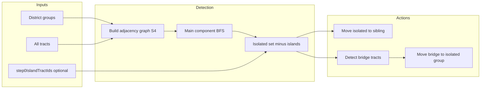

# Tract Isolation Spec and Implementation Documentation Plan

## 1. Current state summary

### 1.1 Documentation and locations

- **Island (step 0) behavior**: [doc/history/251204-island-tract-detection.md](doc/history/251204-island-tract-detection.md) — Step 0 isolated tracts are treated as geographic islands; exclude from isolation in all later steps; DG polygon = main component + 0+ island polygons. **Discrepancy**: Project rules reference `doc/pages/251204-island-tract-detection.md` and `doc/pages/MOVE_ISOLATED_TRACTS_FUNCTION.md`; actual files are under **doc/history/**.
- **Move isolated**: [doc/history/MOVE_ISOLATED_TRACTS_FUNCTION.md](doc/history/MOVE_ISOLATED_TRACTS_FUNCTION.md) — Describes source of isolated list (component state, not step cache), DG swap (`tract_DG` ↔ `sibling_DG`), recursive processing, cache invalidation.
- **Protocol**: [doc/protocol/GDIPs/gdip-004-core-algorithm.md](doc/protocol/GDIPs/gdip-004-core-algorithm.md) §3 Contiguity management: (a) detect isolated using adjacency, (b) move to adjacent groups **while maintaining population balance**, (c) handle bridge tracts.

### 1.2 Implementation (backend)

- **Detection**: [backend/services/geodistrict-algorithm.js](backend/services/geodistrict-algorithm.js) — `detectIsolatedTracts(districtGroups, allTracts, stepNumber, step0IslandTractIds)`. Isolation = not reachable from main component (BFS from tract with `maxReachableCount`). Step 0: isolated → island groups, not added to `isolatedTractsByGroup`. Steps 1+: tracts in `step0IslandTractIds` are removed from isolated set (doc 251204).
- **Adjacency**: `buildGeometryAdjacencyGraph(tracts)` uses S4 adjacency data (state from `STATE` or `STATE_FIPS`; normalized via [backend/services/s4-data-loader.js](backend/services/s4-data-loader.js) for FIPS/abbreviation). Empty/mismatched S4 → empty graph → “nearly all isolated” (see [.cursor/archive/2026-02/260208-tract-isolation-fix.md](.cursor/archive/2026-02/260208-tract-isolation-fix.md), [.cursor/archive/2026-02/260213-isolated-tracts-az-fix.md](.cursor/archive/2026-02/260213-isolated-tracts-az-fix.md)).
- **Move isolated**: `moveIsolatedTractsToOppositeGroup` → `_moveTractsToGroup`. Sibling from `sibling_DG` on tract or from `divisionLines`. Validation: skip move if tract would have no neighbors in target (infinite-loop prevention). No population rebalancing.
- **Bridge detection**: `detectBridgeTracts` — see §2 below.
- **Bridge move**: `moveBridgeTractsAndRecheck` → `_moveBridgeTractsToGroup`: move from sibling DG to isolated group; swap `tract_DG`/`sibling_DG`.

### 1.3 Frontend

- [frontend/src/app/pages/maps-page.component.ts](frontend/src/app/pages/maps-page.component.ts) — `isolatedTractsData` / `bridgeTractsData` in component state; detect/move isolated and detect/move bridge trigger backend calls. Step cache can store `isolatedTractsData` for display; staleness check (`isStaleIsolatedTractsData`) when loading from cache.
- [frontend/src/app/services/geodistrict-algorithm.service.ts](frontend/src/app/services/geodistrict-algorithm.service.ts) — `detectIsolatedTracts(districtGroups, allTracts)` only; no `stepNumber` or `step0IslandTractIds` sent.

---

## 2. Bridge tract detection — purpose and how it works

**Purpose**: Connect isolated tracts to the group’s main component by moving a tract from the **sibling** district group that sits between isolated tracts and the main component (a “bridge”).

**How it works**:

1. **Scope**: Only consider tracts in the **sibling group** (the other half of the same parent division). Sibling comes from `tract.properties.sibling_DG` or division metadata.
2. **Candidates**: Tracts in the sibling group that are adjacent (S4 graph) to at least one isolated tract in the isolated group.
3. **Filter** (must “help connect”):
  - Count neighbors of the candidate in the **isolated group’s main component** (reachable count ≥ 95% of group max).
  - **willHelpConnect** = (neighborsInIsolatedMainComponent > 0) and (adjacentIsolatedCount ≥ 1).
  - **Included**:
    - Large isolation (≥10 isolated): include if `adjacentIsolatedCount ≥ 3` OR willHelpConnect.
    - Small isolation: include only if willHelpConnect.
4. **Order**: Sort by `adjacentIsolatedCount` descending (best bridges first).
5. **Move**: Bridge tracts are moved **from sibling group to isolated group**; `tract_DG` and `sibling_DG` are swapped on the moved tract.

References: [backend/services/geodistrict-algorithm.js](backend/services/geodistrict-algorithm.js) `detectBridgeTracts` (~2266–2487), `_moveBridgeTractsToGroup`; [.cursor/archive/2025-11/251125.md](.cursor/archive/2025-11/251125.md) (target group fix: move to isolated group, not sibling).

---

## 3. DG balancing rules / logic

- **Division**: Lat/long division uses population targets (e.g. floor(n/2)/n and ceil(n/2)/n). No balancing logic in the **move** paths.
- **Move isolated / move bridge**: Only DG swap and group stats (population, bounds, centroid) update. **No** “move adjacent tracts back” or other rebalancing.
- **GDIP-004**: Requires “maintaining population balance” when moving isolated tracts; current implementation does **not** perform an explicit rebalancing step after moves. Changelog in [backend/services/geodistrict-algorithm.js](backend/services/geodistrict-algorithm.js) (e.g. 20251119, 20251122) mentions balancing by moving adjacent tracts back, but that logic is not present in `moveIsolatedTractsToOppositeGroup` or `_moveTractsToGroup` — either never added or removed.

**Conclusion**: Document that (1) division is population-targeted, (2) move-isolated and move-bridge are DG-only swaps with no rebalancing, and (3) GDIP-004’s “maintaining population balance” is a spec/implementation gap to resolve (optional follow-up: add rebalance step or clarify spec).

---

## 4. Discrepancies and issues

| Issue                                                         | Where                                      | Detail                                                                                                                                                                                                                                                                                                                                                                                                                                                           |
| ------------------------------------------------------------- | ------------------------------------------ | ---------------------------------------------------------------------------------------------------------------------------------------------------------------------------------------------------------------------------------------------------------------------------------------------------------------------------------------------------------------------------------------------------------------------------------------------------------------- |
| **Step 0 island exclusion not applied for standalone detect** | Backend + frontend                         | `POST /api/algorithm/detect-isolated-tracts` does not accept `stepNumber` or `step0IslandTractIds`. Frontend only sends `districtGroups` and `allTracts`. So when user loads step 3 and clicks “Detect Isolated Tracts”, geographic islands (e.g. CA’s 5 tracts) can be falsely reported as isolated. Same for re-detection inside `move-all-isolated-tracts` (fast path and cache path call `detectIsolatedTracts(updatedGroups, allTracts)` with 2 args only). |
| **Doc paths in project rules**                                | .cursorrules / GeoDistrictsProjectOverview | Rules point to `doc/pages/251204-island-tract-detection.md` and `doc/pages/MOVE_ISOLATED_TRACTS_FUNCTION.md`; files live in **doc/history/**.                                                                                                                                                                                                                                                                                                                    |
| **Population balance (GDIP-004)**                             | Spec vs implementation                     | GDIP-004 §3(b) says move isolated “while maintaining population balance”; implementation does not rebalance after moves.                                                                                                                                                                                                                                                                                                                                         |
| **Isolation definition**                                      | Archive vs code                            | [.cursor/archive/2025-11/2025-11-06/isolation-check-implementation.md](.cursor/archive/2025-11/2025-11-06/isolation-check-implementation.md): “isolated if reachableCount < maxReachableCount” — matches current code (main component = max reachable; isolated = not in that set). No discrepancy.                                                                                                                                                              |

---

## 5. Plan: tract isolation spec and implementation doc

### 5.1 Create a single tract isolation doc

**Suggested location**: `doc/pages/TRACT_ISOLATION_SPEC_AND_IMPLEMENTATION.md` (or under `doc/protocol/` if preferred for spec-only content).

**Suggested sections**:

1. **Purpose and scope** — Contiguity management (GDIP-004): detect isolated tracts, move them, handle bridge tracts; distinguish geographic islands (step 0) from division-induced isolation (steps 1+).
2. **Definitions**
  - **Isolated tract**: In a district group, a tract not in the main connected component (main component = set of tracts reachable from a tract with maximum reachable count; adjacency from S4).
  - **Island tract (step 0)**: At step 0, a tract in a component other than the main one; treated as geographic island, excluded from “isolated” in all steps.
  - **Bridge tract**: A tract in the **sibling** DG that is adjacent to isolated tracts and, when moved to the isolated group, helps connect them to the main component (neighbor in main component + adjacent to ≥1 isolated; relaxed for large isolations).
3. **Data dependencies** — S4 adjacency; state normalization (FIPS vs abbreviation); tract ID format consistency (getTractId, GEOID); step 0 island set for steps 1+.
4. **Detection**
  - Inputs: district groups, all tracts, optional step number, optional step0IslandTractIds.
  - Algorithm: build adjacency graph (S4); per group, maxReachableCount; BFS from main-component tract; isolated = in group and not reachable; at step 0, output island groups and do not add to isolated; at steps 1+, subtract step0IslandTractIds from isolated.
  - Outputs: isolatedTractsByGroup, isolatedTractIds, groupStats; at step 0 only: islandTractsByGroup.
5. **Bridge tract detection** — Purpose (§2 above); scope (sibling only); candidate selection; filter (willHelpConnect, large vs small isolation); ordering; no move in detection.
6. **Moving isolated tracts** — Target = sibling group (sibling_DG); validation (has neighbor in target); DG swap; no population rebalancing; cache/state updates (backend: update currentGroups, invalidate step and later steps; frontend: recursive process all groups, use latest isolation result).
7. **Moving bridge tracts** — From sibling to isolated group; same DG swap; re-detect after move.
8. **Implementation notes**
  - Backend: `geodistrict-algorithm.js` (detectIsolatedTracts, detectBridgeTracts, moveIsolatedTractsToOppositeGroup, moveBridgeTractsAndRecheck, _moveTractsToGroup, _moveBridgeTractsToGroup); `buildGeometryAdjacencyGraph`; S4 loader and state normalization.
  - API: detect-isolated-tracts, detect-bridge-tracts, move-isolated-tracts, move-bridge-tracts, move-all-isolated-tracts (fast path when frontend sends districtGroups + isolatedTractsData + divisionLines).
  - Frontend: maps-page (detect/move isolated, detect/move bridge); geodistrict-algorithm.service (no step/island params for detect).
9. **Known gaps and discrepancies**
  - Standalone detect API and move-all-isolated re-detection do not pass step0IslandTractIds (islands can be falsely reported as isolated).
  - GDIP-004 population balance: not implemented after moves.
  - Doc paths in project rules: island and move-isolated docs are under doc/history/, not doc/pages/.

### 5.2 Fix references and API (optional follow-ups)

- **Update project rules / overview**: Point to `doc/history/251204-island-tract-detection.md` and `doc/history/MOVE_ISOLATED_TRACTS_FUNCTION.md` (or to the new consolidated doc once created).
- **API and re-detection**: Extend `POST /api/algorithm/detect-isolated-tracts` to accept optional `stepNumber` and `step0IslandTractIds` (or `state` + `step` and have backend load step 0 from cache to derive island IDs when step > 0). Use same params in move-all-isolated-tracts re-detection so island exclusion is consistent.
- **Population balance**: Either add a rebalance step (e.g. move adjacent tracts from target back to source to restore ratio) per GDIP-004, or explicitly document that balance is not restored after moves and adjust GDIP text if the protocol allows.

---

## 6. Diagram (high-level flow)

---

## 7. Files to create or update

| Action   | File                                                                                                                                                  |
| -------- | ----------------------------------------------------------------------------------------------------------------------------------------------------- |
| Create   | `doc/pages/TRACT_ISOLATION_SPEC_AND_IMPLEMENTATION.md` (or chosen path) with sections above                                                           |
| Optional | Update `.cursorrules` / [doc/GeoDistrictsProjectOverview.md](doc/GeoDistrictsProjectOverview.md) to fix doc paths and link to new tract isolation doc |
| Optional | Backend: extend detect-isolated-tracts and move-all-isolated-tracts to support step0IslandTractIds / stepNumber                                       |
| Optional | Frontend: pass step and step0IslandTractIds (from step 0 cache or current step’s stored island data) when calling detectIsolatedTracts                |

No code or doc edits are made in this plan phase; the plan only specifies what to document and where, plus optional fixes.