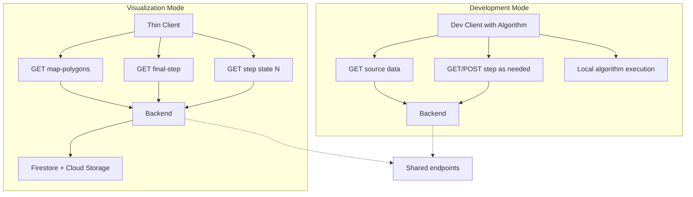

# Two-Mode Architecture: Visualization vs Development

## Current State Summary

- **Backend**: ~4,750 LOC in [backend/services/geodistrict-algorithm.js](backend/services/geodistrict-algorithm.js), ~8,700 in [backend/index.js](backend/index.js). Owns full algorithm: step 0 init, lat/long division, isolation/bridge detection, balancing, union polygon creation. Caches steps in Firestore (normalized tract IDs) and union polygons in Cloud Storage.
- **Frontend**: [frontend/src/app/services/geodistrict-algorithm.service.ts](frontend/src/app/services/geodistrict-algorithm.service.ts) orchestrates runs: `runGeodistrictAlgorithmStepByStep` and `executeAllSteps` call backend `POST /api/algorithm/execute`; `initializeAlgorithm` uses `GET final-step` then `POST execute/step-by-step`; `getStep(state, stepNumber)` loads from backend. **Critical**: “Local” next step (`executeNextStepLocally`) still calls backend for division: [frontend/src/app/services/latlong-division.service.ts](frontend/src/app/services/latlong-division.service.ts) uses `POST /api/algorithm/latlong/divide` (with optional cache). So the client is never fully independent of the backend for algorithm execution.
- **Lightweight path already exists**: `GET /api/algorithm/map-polygons/:state` returns state outline + final district polygons from Cloud Storage (no algorithm run). Maps page uses this for “map-only” view and for US map.

---

## Proposed Modes

| Mode              | Purpose                                                                    | Client                                 | Backend                                    |
| ----------------- | -------------------------------------------------------------------------- | -------------------------------------- | ------------------------------------------ |
| **Visualization** | View final geodistricts and step-through division; campaign/public traffic | Thin: only GET step state and polygons | Serves step cache + union polygons only    |
| **Development**   | Build and test algorithm (isolation, bridge, balancing, step 0, etc.)      | Algorithm logic in client; run locally | Shared data endpoints + optional step save |

---

## Architecture Diagram

---

## Pros and Cons

### Visualization mode (thin client, GET-only)

| Pros                                                                                     | Cons                                                                                                 |
| ---------------------------------------------------------------------------------------- | ---------------------------------------------------------------------------------------------------- |
| Clear separation of concerns; backend only serves state                                  | Current maps page mixes “run” and “view”; needs refactor to hide run when data exists                |
| Small payloads (union polygons only) already supported via `map-polygons` and step cache | Step list (indices + metadata) not a single endpoint today; step-through fetches each step on demand |
| Scales for campaign: no CPU-heavy algorithm runs, only reads                             | Mobile: ensure step N response can be union-only (no tract geometries)                               |
| Fits “algorithm complete → evangelize” story                                             |                                                                                                      |

### Development mode (algorithm client-side)

| Pros                                                                   | Cons                                                                                                                                  |
| ---------------------------------------------------------------------- | ------------------------------------------------------------------------------------------------------------------------------------- |
| No “blind” waiting on backend; step execution is local and responsive  | **Algorithm duplication**: Backend algo is ~4.7k LOC (JS). Full client-side = port to TS or shared package (large effort, drift risk) |
| Iteration and debugging faster when running locally                    | Union polygon creation today is backend (turf). Client would need turf.js and same S4-ordered union logic for display in dev          |
| Optional save to backend keeps step state for later visualization      | Isolation/bridge/balance logic is non-trivial; port must stay in sync with backend                                                    |
| Dev typically local; no need to run heavy backend in GCP for algo work |                                                                                                                                       |

### Shared endpoints (both modes)

- **Data**: Census proxy, TIGER/source boundaries, S4 adjacency, state tract cache (for step 0 init).
- **Step state**: GET `final-step`, GET `step/:state/:stepNumber`, GET `map-polygons/:state`, GET `final-step-states`.
- **Dev-only (optional)**: POST `execute`, POST `execute/step-by-step`, POST `execute/next-step`, POST `latlong/divide`, isolation/bridge/balance endpoints, and step write (if dev saves state).

---

## Recommendations

### 1. Formalize visualization mode (high priority)

- **Use current `/maps` as the visualization entry point** when a state has precomputed data.
- **Behavior**: On state select, call `GET final-step` (or `map-polygons`) first. If final step exists:
  - Show map and step slider; **hide** “Run All Steps” and “Next Step” (or show disabled with tooltip “Precomputed; use dev mode to re-run”).
  - Step-through via `getStep(state, stepNumber)` only (no POST execute/next-step).
- **Payloads**: Prefer union-only for steps in visualization. Add optional query e.g. `GET /api/algorithm/step/:state/:stepNumber?polygonsOnly=true` that returns district groups with union geometries only (no tract-level geometries) to keep step-through light on mobile.

### 2. Add `/dev/maps` for development

- **New route** [frontend/src/app/app.routes.ts](frontend/src/app/app.routes.ts): e.g. `{ path: 'dev/maps', component: DevMapsPageComponent }`.
- **Content**: Reuse or duplicate the current maps page **logic that runs the algorithm** (run all, next step, isolation/bridge/balance, step 0 tools). Dev page should:
  - Use **shared** services for: census/TIGER/S4 (existing proxy and data endpoints), and `getStep` / optional step save.
  - Either:
    - **Option A (recommended short-term)**: Keep using backend for execution. Dev page calls same `execute`, `execute/step-by-step`, `execute/next-step`, and isolation/bridge/balance APIs. No algorithm port. Run backend locally for dev. Reduces “blind” wait by showing per-step progress (e.g. “Running step 2…”). **No new algorithm implementation**; only UI/orchestration split from `/maps`.
    - **Option B (full client algo)**: Port backend algorithm to TypeScript and run entirely in client on `/dev/maps`. Single source of truth: shared package (e.g. `@geodistricts/algorithm`) consumed by backend (Node) and frontend (bundled). High effort and ongoing sync; only justify if backend execution latency and coupling become blocking.

### 3. Backend production hardening

- **Visualization-only in production**: In deployed (GCP) environment, consider disabling or rate-limiting POST `execute`, `execute/step-by-step`, `execute/next-step`, and `latlong/divide` so production traffic is read-only (map-polygons, final-step, step). Dev runs against local backend.
- **Keep** all GET endpoints and census/TIGER/S4 data endpoints for both modes.

### 4. Payload and performance (visualization)

- **Already in place**: `map-polygons/:state` returns only state outline + final district polygons (Cloud Storage).
- **Enhance**: For step-through, ensure `GET step/:state/:stepNumber` can return **union-only** (no tract geometries) when requested, so mobile step-through stays small. Document that visualization clients should use this when available.
- **Step list**: Optional `GET /api/algorithm/step-list/:state` returning `{ stepIndices: number[], finalStepNumber: number }` (or similar) so the client can show step scrubber without fetching each step until user selects one.

### 5. Complexity and risk summary

| Approach                                                      | Complexity               | Performance (viz)               | Supports both modes | Risk                                        |
| ------------------------------------------------------------- | ------------------------ | ------------------------------- | ------------------- | ------------------------------------------- |
| Formalize viz + `/dev/maps` with backend execution (Option A) | Low                      | High (GET-only, union polygons) | Yes                 | Low                                         |
| Full client algorithm (Option B)                              | High (port + shared pkg) | High                            | Yes                 | Medium (drift, two impls)                   |
| No split (current)                                            | —                        | Mixed (run + view same page)    | Partial             | Continued coupling and “blind” waits in dev |

**Recommended path**: Implement **visualization behavior** on `/maps` (GET-only when data exists, hide run controls), add `**/dev/maps**` that mirrors current “run algorithm” behavior and calls backend (Option A). Add **union-only step** and optional **step-list** endpoint for mobile and clarity. Defer full client-side algorithm (Option B) unless backend execution becomes a real blocker.

---

## Implementation Outline (if proceeding)

1. **Maps page (visualization)**
  - On state load: if `final-step` or `map-polygons` has data, set “visualization-only” flag; hide or disable Run All / Next Step; step navigation uses `getStep` only.
2. **New `/dev/maps**`
  - New component (or lazy-loaded route) that contains current “run algorithm”, “next step”, isolation/bridge/balance, and step 0 controls; same backend endpoints as today.
3. **Backend**
  - Optional `polygonsOnly` (or similar) on `GET step/:state/:stepNumber`; optional `GET step-list/:state`; consider gating POST execute/next-step in production.
4. **Docs**
  - Update [doc/GeoDistrictsProjectOverview.md](doc/GeoDistrictsProjectOverview.md) and architecture docs to describe Visualization vs Development modes and which endpoints each uses.

This keeps the algorithm in one place (backend), makes visualization thin and scalable, and gives developers a dedicated dev surface without a large port.