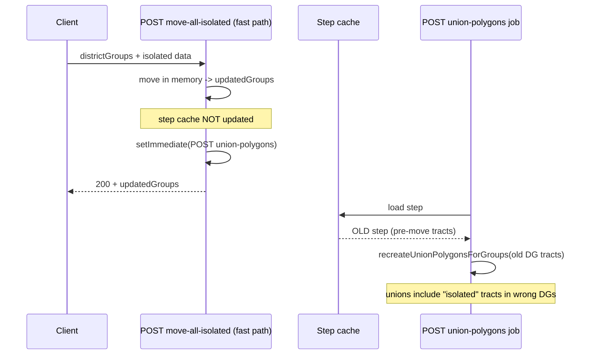

# Ensure POST union-polygon Uses Updated DG Tracts After Move Isolated

## Problem

POST union-polygon can produce polygons that still show isolated tracts because it builds unions from whatever step data is in the **step cache**. After move-isolated-tracts:

- **Fast path** (move-all-isolated-tracts): The backend updates groups in memory (`updatedGroups`) and triggers POST union-polygons via `setImmediate`, but **never writes the updated step to the step cache**. The union-polygon job then loads the step from cache and gets the **pre-move** tract assignments, so unions are built from the old DG tract lists.
- **Cache path** (move-all-isolated-tracts): The step is saved with `setStepCache` (with updated tracts), then POST union-polygons is triggered — ordering is correct here.
- **Single move** (POST move-isolated-tracts): The handler **deletes** the step cache and does not write it back. Any later POST union-polygons would 404 or see stale data if another code path had written the step.

So the bug is: **fast path does not persist the new tract list before triggering the union-polygon job**, and **single move only deletes the cache** instead of updating it.

## Root cause (data flow)

## Intended behavior

- **Always** persist the step’s district groups (with updated tract lists) to the step cache **before** triggering or running POST union-polygons.
- Then the union-polygon job (or any caller of POST union-polygons) loads the step from cache and gets the **post-move** tract assignments.

## Implementation

### 1. Fast path of move-all-isolated-tracts ([backend/index.js](backend/index.js))

**Location:** ~7705–7760 (block where `canUseFastPath` is true, after the move loop and `stepCompleteForUnions`).

- **Before** calling `setImmediate(() => axios.post(unionPolygonsUrl, {}))`, **save the updated step to the step cache** so the union-polygon job reads post-move data.
- Build a step payload from:
  - `districtGroups`: `updatedGroups` (already have full `censusTracts`)
  - `divisionLines`: `bodyDivisionLines` (from request)
  - Any other fields needed for a minimal step (e.g. `state`, `step`) so normalization and reconstruction work.
- Use the same cache key as elsewhere: `algorithm_step_${state}_${maxIterations}_${step}`.
- Use existing helpers:
  - `tractCacheKey = state_tracts_${state}` (or resolve from state tract cache if needed).
  - `normalizeStepData(stepPayload, tractCacheKey)` to get normalized step data (censusTractIds, etc.).
  - `setStepCache(stepCacheKey, cacheData)` with the same shape as the cache path: `stepData: normalized.normalized`, `isComplete: true` when `totalRemaining === 0`, `algorithmVersion`, `timestamp`, `ttl`, `source`, `normalized: true`, `tractCacheKey`, `state`, `step`, `unionPolygonsCached: false`.
- **Await** `setStepCache(...)` so the write completes before the response is sent and before `setImmediate` runs.
- **Then** call `setImmediate(() => axios.post(unionPolygonsUrl, {}))` unchanged.

Result: When the union-polygon job runs, it loads the step from cache and gets the updated DG tract lists.

### 2. Single move-isolated-tracts ([backend/index.js](backend/index.js))

**Location:** ~7590–7625 (after updating algorithm state and invalidating caches).

- **After** updating `algorithmState` and **after** deleting the step cache (and invalidating subsequent caches), **write the updated step back** to the step cache instead of leaving it deleted.
- Use:
  - Updated step content: `algorithmState.steps[step]` (already set to `{ ...algorithmState.steps[step], districtGroups: result.districtGroups }`).
  - `tractCacheKey` from `algorithmState.tractCacheKey`.
  - Same `stepCacheKey` used for the delete: `algorithm_step_${state}_${maxIterations}_${step}`.
- Build cache payload: normalize the step with `normalizeStepData(algorithmState.steps[step], algorithmState.tractCacheKey)`, then `setStepCache(stepCacheKey, { stepData: normalized.normalized, isComplete: false, algorithmVersion, timestamp, ttl, source, normalized: true, tractCacheKey, state, step, unionPolygonsCached: false })` (or match existing step-cache shape). Do **not** trigger POST union-polygons from single-move unless product behavior explicitly requires it; the goal here is to make the cache correct for any later POST union-polygons (e.g. from the client or a “Build union polygons” action).

Result: Step cache always reflects the current DG tracts after a move; any subsequent POST union-polygons uses the correct tract list.

### 3. Cache path of move-all-isolated-tracts (no change)

The cache path already awaits `setStepCache(stepCacheKey, cacheData)` and then triggers POST union-polygons in `setImmediate`. No change needed; just ensure the fast path matches this ordering (save first, then trigger job).

### 4. POST union-polygons handler (no change)

The handler and `runUnionPolygonGenerationJob` already load the step from the step cache and build unions from `stepData.districtGroups`. No change; the fix is ensuring the cache is written **before** the job is triggered (fast path) or before any future POST (single move).

## Files to change

- **[backend/index.js](backend/index.js)**  
  - In the **move-all-isolated-tracts** fast path: before `setImmediate(() => axios.post(unionPolygonsUrl, ...))`, build the step payload from `updatedGroups` and `bodyDivisionLines`, normalize it, then `await setStepCache(stepCacheKey, cacheData)`; then call `setImmediate(...)`.  
  - In **move-isolated-tracts** (single): after invalidating the step cache, write the updated step (from `algorithmState.steps[step]`) back with `normalizeStepData` and `setStepCache`.

## Edge cases

- **Fast path step payload:** If the frontend does not send `divisionLines`, use `[]`. Ensure `normalizeStepData` receives district groups with `censusTracts` so it can produce `censusTractIds`; `updatedGroups` already has `censusTracts`.
- **State tract cache:** Fast path uses `tractCacheKey = state_tracts_${state}`; if the project uses a different key (e.g. normalized state), reuse the same resolution logic as the cache path (e.g. try state as-is / lowercase / uppercase) for consistency.
- **Single move and algorithm state:** If `algorithmState` is missing, skip writing the step (current behavior of not persisting remains). Only write when we have a valid updated step in `algorithmState.steps[step]` and `algorithmState.tractCacheKey`.

## Verification

- After “Move isolated tracts” on the fast path (full district groups + isolated data sent): step cache doc for that step contains normalized `districtGroups` with post-move `censusTractIds`; union-polygon job runs and builds unions that match the moved tracts (no isolated tracts in wrong DGs).
- After single move-isolated-tracts: step cache is re-written with updated `districtGroups`; a later POST union-polygons for that step loads the updated step and builds correct unions.
- Cache path behavior unchanged: step still saved then POST union-polygons triggered; unions match moved tracts.
