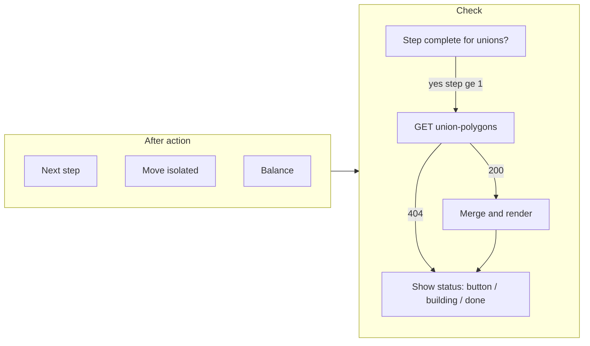

# Union polygon per-step status and build button

## Goal

After each step is "complete" (all isolated tracts resolved and balanced so district groups are within target population variance), union polygons should be available and drawn. The UI must:

1. After each **Next**, **Move**, or **Balance** action, check whether the current step is complete and whether the union-polygon process for that step has been started or completed.
2. Always show union polygon status: **not started** (show "Build union polygon" button), **in progress** ("building DG polygons..."), or **completed** (show union polygon on map only).
3. When **Show tracts** is off: show DG polygon filled by party (existing behavior).
4. When **Show tracts** is on: show DG polygon **border only** and tracts colored by their tract party (tract coloring exists; add DG outline when union exists).

---

## 1. "Step complete" for union polygon purpose

- **Non-final steps (step index 1..N-1):** Considered complete as soon as the step is displayed (no Move/Balance at that step).
- **Final step (all single-district DGs):** Complete only when `!hasUnresolvedIsolation && finalStepBalancingComplete`.
- **Step 0:** No union polygon build (backend rejects `POST .../union-polygons` for step 0). Do not show Build button for step 0.

Reuse existing: `hasUnresolvedIsolation`, `finalStepBalancingComplete`, `isFinalStepActive` in [maps-page.component.ts](frontend/src/app/pages/maps-page.component.ts).

---

## 2. Union polygon status for current step

Backend already provides:

- **GET** `/api/algorithm/step/:state/:stepNumber/union-polygons` — 200 with `districtGroups` (with `unionPolygon`/`unionPolygons`) when cached; 404 when not available or not yet built.
- **POST** same URL — 202 Accepted, starts background job (child process). Client should poll GET until 200.

There is no backend "in progress" flag; infer state on the client:

- **Not started:** GET returns 404 and we have not triggered POST for this step.
- **In progress:** We triggered POST for this step and GET still returns 404 (poll GET periodically).
- **Completed:** GET returns 200; merge payload into `currentStep.districtGroups` and re-render.

---

## 3. Frontend state and logic

**New state (e.g. in [maps-page.component.ts](frontend/src/app/pages/maps-page.component.ts)):**

- `unionPolygonBuildTriggeredForStep: number | null` — step index for which we sent POST (so we show "building DG polygons..." and poll).
- Optional: `unionPolygonPollingIntervalId` or subscription so only one poll runs at a time; clear on step change or when GET returns 200.

**New / updated behavior:**

- `**isCurrentStepCompleteForUnionPolygons(): boolean`**  
  - Step 0 → false.  
  - Non-final step → true when we have the step.  
  - Final step → true when `!hasUnresolvedIsolation && finalStepBalancingComplete`.
- `**checkAndUpdateUnionPolygonStatusForCurrentStep(): void`**  
  - If no state/step or step not complete for unions → return.  
  - If step 0 → return (no union build).  
  - Call `getStepUnionPolygons(state, currentStepIndex, maxIterations)`.  
  - On 200: merge into `currentStep`, call `renderFinalDistricts()`, clear `unionPolygonBuildTriggeredForStep` for this step, stop polling.  
  - On 404: if `unionPolygonBuildTriggeredForStep === currentStepIndex` → treat as in progress, ensure polling is running; else → show "Build union polygon" (not started).
- **Invoke `checkAndUpdateUnionPolygonStatusForCurrentStep()` after:**
  - **Next** step completes (in the `nextStep()` success path, after setting `currentStep` / `currentStepIndex` and calling `renderFinalDistricts` / `onStepDisplayComplete`).
  - **Move** isolated tracts success (in `moveIsolatedTracts` subscribe `next`; re-check because step may now be complete after balance).
  - **Balance** success (in `balanceDistrictsAfterIsolated` subscribe `next`).
  - **Loading a step by index** (e.g. when navigating to a step via slider or "previous step") — after step is set and rendered, so union status is correct when viewing that step.
- **Build union polygon button:**  
  - Calls existing `generateStepUnionPolygons(state, currentStepIndex, maxIterations)` (POST).  
  - On 202: set `unionPolygonBuildTriggeredForStep = currentStepIndex`, show "building DG polygons...", start polling GET every few seconds (e.g. 3s) with a timeout (e.g. 5 min). On GET 200, merge, render, clear trigger and stop poll.
- **When step or state changes:** Clear `unionPolygonBuildTriggeredForStep` if it no longer matches current step (and stop polling).

Existing `mergeUnionPolygonsIntoStep` and `getStepUnionPolygons` in [geodistrict-algorithm.service.ts](frontend/src/app/services/geodistrict-algorithm.service.ts) and maps-page can be reused; ensure merge is applied to `currentStep` and `loadedSteps[currentStepIndex]` so the map and any tables stay in sync.

---

## 4. UI: always show union polygon status

- **Where:** One place visible whenever the current step is "complete" for unions and step ≥ 1 (e.g. near the step indicator or above the district groups table). Do **not** gate this behind dev mode only; keep it visible in normal maps flow when step is complete.
- **States:**
  - **Not started:** Show a single **"Build union polygon"** button (POST for current step only).
  - **In progress:** Show text **"building DG polygons..."** (and disable or hide the build button while polling).
  - **Completed:** No status line needed; map shows the union polygon(s). Optionally show short "DG polygons cached" for clarity.

Remove or relax the current condition that only shows Build Polygons when `isDevMode && isFinalStepActive` (see [maps-page.component.html](frontend/src/app/pages/maps-page.component.html) around 378–387 and 633–643). Replace with the new per-step union status that applies to any step ≥ 1 when `isCurrentStepCompleteForUnionPolygons()`.

Existing `needsBuildPolygons()` / `triggerPolygonsForAllMissing()` are final-step and per-group-status based; the new flow is **per-step** and uses GET 404/200 for status. Either introduce a separate "Build union polygon (this step)" button and status for the new logic, or unify so the single "Build union polygon" triggers POST for the **current step** and status is derived from GET for that step.

---

## 5. Map display: show tracts ON → DG border + tracts by party

Current behavior in [maps-page.component.ts](frontend/src/app/pages/maps-page.component.ts) `renderFinalDistricts()`:

- When **show tracts OFF:** use union polygon(s) if present (filled by DG/party). Already implemented.
- When **show tracts ON:** only tracts are drawn (colored by tract party when available); union polygon is not drawn.

**Change:** When **show tracts is ON** and the district group has union polygon data, **also** draw the DG union polygon as an **outline only** (e.g. no fill or very low fill, visible border weight) so the DG boundary is visible while tracts are colored by tract party. Draw order: tracts first, then DG outline on top (or ensure outline is visible). Use the same union geometry already used when show tracts is off; only the style differs (border-only when show tracts on).

---

## 6. Backend

No backend changes required. Existing endpoints:

- `GET /api/algorithm/step/:state/:stepNumber/union-polygons` — use for status and to merge polygons.
- `POST /api/algorithm/step/:state/:stepNumber/union-polygons` — use for "Build union polygon" (step 0 rejected with 400).

---

## 7. Flow summary

---

## 8. Files to touch

- **[frontend/src/app/pages/maps-page.component.ts](frontend/src/app/pages/maps-page.component.ts):** Add `unionPolygonBuildTriggeredForStep`, `isCurrentStepCompleteForUnionPolygons()`, `checkAndUpdateUnionPolygonStatusForCurrentStep()`, and polling; call check after Next/Move/Balance and when loading a step; in `renderFinalDistricts()` when `showTractBoundaries` is true and DG has union polygon, draw DG outline only.
- **[frontend/src/app/pages/maps-page.component.html](frontend/src/app/pages/maps-page.component.html):** Replace or extend the union polygon section so it always shows (when step complete and step ≥ 1): Build button, or "building DG polygons...", or nothing when completed; ensure it is not dev-only.
- **[frontend/src/app/services/geodistrict-algorithm.service.ts](frontend/src/app/services/geodistrict-algorithm.service.ts):** No change; already has `getStepUnionPolygons` and `generateStepUnionPolygons`.

---

## 9. Edge cases

- **Step 0:** Never show Build union polygon; backend rejects POST. No status line needed or show "N/A" for step 0 if status is always visible.
- **Polling:** On step change, stop any active polling and clear `unionPolygonBuildTriggeredForStep` for the previous step.
- **Final step not yet complete:** Until isolation is resolved and balance is complete, do not show Build button (step not "complete" for unions). After Balance sets `finalStepBalancingComplete`, next check will show button or "building..."/completed as appropriate.

