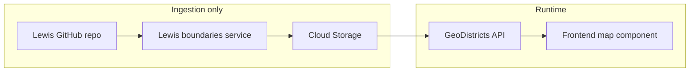

# US Congressional District Map Component (revised)

## Goal
- New component: US map showing **current (official) congressional district boundaries** from [JeffreyBLewis/congressional-district-boundaries](https://github.com/JeffreyBLewis/congressional-district-boundaries), with boundaries drawn in **orange**.
- **Alaska** and **Hawaii**: scaled and placed in the **lower-left** (standard inset style).
- **Configurable by Congress number** (e.g. 119th); default = **119** (latest).
- **Placement**: (1) Add to **home page**. (2) On **maps page**, when **US / All** is selected, show this component **instead of** the existing Leaflet US map.

---

## Data flow and licensing

### Source repo: license and terms
- **License**: [MIT](https://github.com/JeffreyBLewis/congressional-district-boundaries/blob/master/LICENSE). Copyright (c) 2013–2018 Jeffrey B. Lewis. Permission granted to use, copy, modify, merge, publish, distribute, sublicense, and/or sell copies, **provided the copyright notice and permission notice are included in all copies or substantial portions**.
- **README**: Requests that if you use the shapes in research, you send an email describing the project and citing related work. For product use we should **include attribution** (e.g. in app UI or docs): e.g. "District boundaries from Jeffrey B. Lewis et al., [congressional-district-boundaries](https://github.com/JeffreyBLewis/congressional-district-boundaries), MIT License."

**Conclusion**: Storing boundary data in our cloud storage and serving it via our API is **permitted under MIT**. We must **include the MIT copyright/permission notice** (in source, docs, or attribution page) and should **attribute the source** in the app.

### Data source format
The repo provides **GeoJSON** as the canonical format (shapefiles on the website are generated from it). Filenames: `{StateName}_{startCongress}_to_{endCongress}.geojson`. We use GeoJSON for storage and API (no shapefile parsing in the app).

### Architecture: Lewis as ingestion only; GeoDistricts serves from cloud

- **Lewis boundary data** is used **only as a data source for ingestion**. A **Lewis boundaries service** (or backend script) **fetches** GeoJSON from the GitHub repo and **uploads** it to **cloud storage** (no direct Lewis calls from the frontend at runtime).
- **Cloud storage**: Store one GeoJSON file per state per Congress (e.g. `congressional-boundaries/119/Alabama.json`) in the existing GCS bucket (`geodistricts-census-data` or equivalent).
- **GeoDistricts service**: A **backend API** that serves **congressional districts by Congress** (and optionally by state), **reading only from cloud storage**. Frontend and map component call this API only.

---

## Implementation plan

### 1. Lewis boundaries service (ingestion only)

- **Role**: Fetch boundary data from the Lewis repo and write to cloud storage. **Not** used by the frontend at runtime.
- **Where**: Backend (Node) so ingestion runs in a script or admin endpoint, not in the browser.
- **Actions**:
  - List GeoJSON files: `GET https://api.github.com/repos/JeffreyBLewis/congressional-district-boundaries/contents/GeoJson` (paginate if needed).
  - Parse filenames: `{StateName}_{start}_to_{end}.geojson`; for a chosen Congress N, select files where N is in [start, end].
  - For each selected file: fetch raw GeoJSON from `https://raw.githubusercontent.com/JeffreyBLewis/congressional-district-boundaries/master/GeoJson/{filename}`.
  - Upload to cloud storage (see below). Cache key / path convention: e.g. `congressional_boundaries_{congress}_{stateName}` → `congressional-boundaries/{congress}/{stateName}.json`.
- **Invocation**: Backend script (e.g. `node scripts/ingest-lewis-boundaries.js --congress=119`) or admin API (e.g. `POST /api/admin/ingest-congressional-boundaries`) that calls this logic. Run once per Congress (or when updating data).

### 2. Cloud storage layout

- **Bucket**: Same as existing census data (e.g. `geodistricts-census-data`).
- **Path**: `congressional-boundaries/{congress}/{stateName}.json` (stateName as in repo: Alabama, Alaska, etc.).
- **Extend** [backend/services/cloud-storage-cache.js](backend/services/cloud-storage-cache.js): In `getFilePath()`, handle keys like `congressional_boundaries_{congress}_{stateName}` and map to `congressional-boundaries/{congress}/{stateName}.json`. Add a direct path helper if needed for `congressional-boundaries/{congress}/{state}.json` so the API can read by congress and state without going through the generic cache key pattern.

### 3. GeoDistricts API (read from cloud only)

- **New backend routes** in [backend/index.js](backend/index.js):
  - `GET /api/congressional-boundaries/:congress` – return list of state identifiers (or state names) that have data for that Congress (e.g. from listing GCS prefix `congressional-boundaries/{congress}/` or from a small manifest).
  - `GET /api/congressional-boundaries/:congress/:state` – return GeoJSON for that Congress and state. **Read from cloud storage only** (e.g. `congressional-boundaries/{congress}/{state}.json`). State can be state name (e.g. Alabama) or state code (e.g. AL); if backend stores by state name, map code → name using existing state tables.
- **No calls to Lewis repo** in these routes; only GCS (or cache layer that reads from GCS).

### 4. Frontend: GeoDistricts congressional-boundaries service

- **New frontend service** (e.g. `congressional-boundaries.service.ts` or extend an existing GeoDistricts API service): 
  - `getBoundariesByCongress(congress: number)`: call `GET /api/congressional-boundaries/:congress` to get state list, then for each state call `GET /api/congressional-boundaries/:congress/:state` (or a bulk endpoint if added), and return GeoJSON per state.
  - Or backend provides a single `GET /api/congressional-boundaries/:congress` that returns all state GeoJSON in one response (or as URLs); then frontend only calls that. Either way, **all data comes from our API/cloud**, not Lewis.
- **Do not** call the Lewis repo or any Lewis URL from the frontend.

### 5. US congressional map component

- **Input**: `congress: number` (default **119**).
- **Data**: Uses only the **GeoDistricts congressional-boundaries service** (our API → cloud storage).
- **Rendering**: Leaflet + GeoJSON; CONUS with orange stroke; Alaska and Hawaii transformed and drawn in lower-left inset (same as in original plan).
- **Attribution**: In the component template or footer, add short text: e.g. "District boundaries: Jeffrey B. Lewis et al., [congressional-district-boundaries](https://github.com/JeffreyBLewis/congressional-district-boundaries), MIT License."

### 6. Home page and maps page integration

- **Home page**: Add the new map component (default Congress 119); ensure attribution is visible (e.g. in section or footer).
- **Maps page**: When `selectedState === 'ALL'`, show the new component instead of the current Leaflet US map; it uses the GeoDistricts API only. Single-state view unchanged.

### 7. Files to add/change (summary)

| Action | File |
|--------|------|
| Add | Backend: script or module that implements Lewis fetch + upload (e.g. `backend/scripts/ingest-lewis-boundaries.js` or `backend/services/lewis-boundaries-ingest.js`). |
| Edit | [backend/services/cloud-storage-cache.js](backend/services/cloud-storage-cache.js) – add path/cache key handling for `congressional-boundaries/{congress}/{state}.json`. |
| Add | [backend/index.js](backend/index.js) – `GET /api/congressional-boundaries/:congress`, `GET /api/congressional-boundaries/:congress/:state` (read from GCS only). |
| Add | Frontend: `congressional-boundaries.service.ts` (or similar) – calls only our API for boundaries by congress. |
| Add | `us-congressional-map.component.ts` (+.html, .scss) – map with CONUS + AK/HI insets, orange boundaries, attribution. |
| Edit | [home-page.component.html](frontend/src/app/pages/home-page.component.html) – add map component. |
| Edit | [maps-page.component.html](frontend/src/app/pages/maps-page.component.html) – when ALL, show new component instead of `#usMap`. |
| Edit | [maps-page.component.ts](frontend/src/app/pages/maps-page.component.ts) – ensure map init only when state selected (not ALL). |

### 8. License compliance checklist

- [ ] **MIT**: Include copyright and permission notice. Options: (1) in repo (e.g. `doc/THIRD_PARTY_LICENSES.md` or similar) for the Lewis dataset, or (2) in the app (e.g. About or Data sources) with a short notice and link to the repo LICENSE.
- [ ] **Attribution in app**: Show "District boundaries: Jeffrey B. Lewis et al., [congressional-district-boundaries](https://github.com/JeffreyBLewis/congressional-district-boundaries), MIT License" on or near the US congressional map.
- [ ] **No redistribution of Lewis code** beyond the boundary GeoJSON we store; we only store and serve the data (GeoJSON), which is permitted under MIT.

---

## Summary

- **Lewis-boundaries**: Used only to **fetch** boundary data (GeoJSON) and **upload** to **cloud storage**. No runtime use in frontend.
- **Cloud storage**: Congressional boundary GeoJSON per state per Congress under e.g. `congressional-boundaries/{congress}/{state}.json`.
- **GeoDistricts service**: Backend API that serves congressional districts by Congress (and state) **from cloud storage only**. Frontend and map component use only this API.
- **License**: Use and storage are consistent with the repo’s **MIT** license; include copyright/permission notice and attribute the source in the app.
