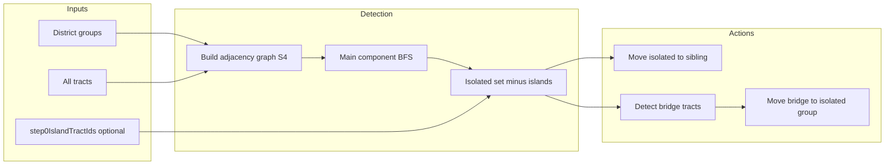

# Tract Isolation Spec and Implementation

This document specifies tract isolation detection and remediation (contiguity management) for the GeoDistricts algorithm and describes the reference implementation.

## 1. Purpose and scope

Contiguity management (GDIP-004 §3) consists of:

- **Detecting isolated tracts** in each district group (DG) after division.
- **Moving isolated tracts** to the adjacent connected group (sibling DG) so they are no longer disconnected.
- **Handling bridge tracts** — tracts in the sibling group that can connect isolated tracts to the main component when moved into the isolated group.

A critical distinction:

- **Step 0**: Tracts not in the main component are treated as **geographic islands** (e.g. CA’s island tracts, HI islands). They are not reported as “isolated” and are excluded from isolation in all later steps.
- **Steps 1+**: Tracts disconnected due to division are **division-induced isolated** and should be detected and moved (or connected via bridge tracts).

## 2. Definitions

- **Isolated tract**: In a district group, a tract that is **not** in the main connected component. The main component is the **largest** connected component (dgAdjacentGroup) in that group; connected components are built in one pass via S4 adjacency. Adjacency comes from S4 data.
- **Island tract (step 0)**: At step 0, a tract in a connected component other than the main one. Treated as a geographic island; excluded from the “isolated” set in **all** steps so they are never flagged for moving.
- **Bridge tract**: A tract in the **sibling** DG that is adjacent to isolated tracts and, when moved into the isolated group, helps connect them to the main component (has a neighbor in the isolated group’s main component and is adjacent to ≥1 isolated tract; relaxed for large isolations).

## 3. Data dependencies

- **S4 adjacency**: Tract-to-tract adjacency is from S4 data (e.g. Census adjacency list). Used by `buildGeometryAdjacencyGraph`. If S4 is missing or tract IDs do not match S4 keys, the graph is empty and nearly all tracts can be falsely reported as isolated.
- **State normalization**: State must be normalized (FIPS vs abbreviation) before S4 lookup; see `s4-data-loader.js` and backend detect-isolated-tracts handler.
- **Tract ID format**: Consistent use of `getTractId` / GEOID (e.g. 11-digit) across tracts and S4 so the adjacency graph is populated correctly.
- **Step 0 island set**: For steps 1+, the set of step-0 geographic island tract IDs must be passed (or derived from step 0 cache) so they are excluded from isolation.

## 4. Detection

### Inputs

- `districtGroups`: All district groups for the current step.
- `allTracts`: All tracts in the dataset (for building the adjacency graph).
- `stepNumber` (optional): Current step; used to treat step 0 as “island detection” and steps 1+ as “isolated detection.”
- `step0IslandTractIds` (optional): Set or array of geographic island tract IDs from step 0; at steps 1+ these are removed from the isolated set.

### Algorithm (one-pass connected components)

1. Build adjacency graph via S4 (`buildGeometryAdjacencyGraph(allTracts)`).
2. For each district group, build **dgAdjacentGroups** (connected components) in a single pass:
   - Use the group’s tract list in order. Maintain a visited set across all components.
   - For each tract in order: if already visited, skip. Otherwise start a new component (Set), add the tract, then BFS over **S4 adjacents that belong to this group only**, adding each to the same Set and to visited. When the frontier is exhausted, append that Set to the list and continue with the next unvisited tract.
   - Repeat until every tract in the group is in exactly one component.
3. **Main component** = the largest dgAdjacentGroup by size. **Isolated** = all tracts not in the main component (all other components).
4. At **step 0**: Do not add to `isolatedTractsByGroup`. Output non-main components as `islandTractsByGroup` (array of arrays per group).
5. At **steps 1+**: Remove any tract ID in `step0IslandTractIds` from the isolated set, then add the remainder to `isolatedTractsByGroup` and `isolatedTractIds`. Also output `isolatedComponentsByGroup` (Map of group index → array of Sets, one per non-main component) for optional use by bridge detection.

### Outputs

- `isolatedTractsByGroup`: Map of group index → set (or array) of isolated tract IDs.
- `isolatedTractIds`: Set (or array) of all isolated tract IDs across groups.
- `groupStats`: Per-group stats (e.g. maxReachable, totalTracts, groupLabel).
- **Step 0 only**: `islandTractsByGroup` (and step-level `islandTractsData` with island groups and counts).
- **Steps 1+**: `isolatedComponentsByGroup` (optional): Map of group index → array of Sets (non-main components), used so bridge detection can run only for components with 2+ tracts.

## 5. Bridge tract detection

**Purpose**: Connect isolated tracts to the group’s main component by moving a tract from the **sibling** DG that sits between isolated tracts and the main component (a “bridge”).

**Scope**: Bridge tract detection **only considers tracts from the original parent DG**. When `isolatedComponentsByGroup` is provided (e.g. from detection), bridge detection runs **only for isolated components with 2+ tracts**; single-tract isolated components are still moved via “move isolated” but do not get bridge detection. The sibling is the other half of the same parent division (e.g. parent DG6-7 splits into DG6-6 and DG7-7; bridge candidates for isolated tracts in DG6-6 come only from DG7-7). Sibling is determined from `tract.properties.sibling_DG` or division metadata. Do not consider tracts outside the parent DG—that would create problems.

**Candidate selection**: Tracts in the sibling group that are adjacent (S4 graph) to at least one isolated tract in the isolated group.

**Filter** (must “help connect”):

- Count neighbors of the candidate in the **isolated group’s main component** (reachable count ≥ 95% of group max).
- **willHelpConnect** = (neighborsInIsolatedMainComponent > 0) and (adjacentIsolatedCount ≥ 1).
- **Included**:
  - Large isolation (≥10 isolated): include if `adjacentIsolatedCount ≥ 3` OR willHelpConnect.
  - Small isolation: include only if willHelpConnect.

**Ordering**: Sort by `adjacentIsolatedCount` descending (best bridges first).

**Note**: Detection does not perform any move; it only returns the list of bridge tracts per isolated group.

## 6. Moving isolated tracts

- **Target**: The **sibling group** (from `sibling_DG` on the tract or from `divisionLines` metadata).
- **Validation**: Before moving, check that the tract has at least one neighbor in the target group. If it has no neighbors in the target, skip the move to prevent infinite loops (tract would remain isolated).
- **Action**: Remove tract from source group(s), add to target group, then **swap** `tract_DG` and `sibling_DG` on the tract.
- **Population balance (compensating move)**: After moving isolated tract(s) to the sibling, perform a compensating move so the two sibling DGs end up within target variance and as close to balanced as possible. Use the **current sibling DG populations** (not the moved-tract population). Build a sorted list of tracts in the target group that have an adjacent tract bordering the source group (boundary tracts). Score each candidate by the resulting population variance between the two sibling groups after the move (distance from ideal split); prefer the tract that minimizes this variance and whose removal from the target would not create new isolated tracts. Target variance (e.g. 1%) is used to prefer outcomes within spec. Move the selected tract(s) from target to source and swap their `tract_DG` / `sibling_DG`. If no suitable tract exists, skip the compensating move.
- **Cache/state**: Backend updates `algorithmState.currentGroups` and invalidates the current step cache and all subsequent step caches. Frontend processes all groups with isolated tracts recursively, using the latest isolation result after each move.

## 7. Moving bridge tracts

- **Direction**: Bridge tracts are moved **from** the sibling group **to** the isolated group (so they connect isolated tracts to the main component).
- **DG swap**: Same as for isolated tracts: swap `tract_DG` and `sibling_DG` on each moved tract.
- **Population balance (optional)**: When moving bridge tract(s) into the isolated group, optionally balance by selecting from the isolated group a tract (or set of adjacent tracts) that borders the sibling_DG and whose population closely matches the moved bridge tract(s), then moving that selection to the sibling. Use the same rule: sorted list of boundary tracts, select by population match.
- **After move**: Re-run isolation detection on the updated district groups.

## 8. Isolation strategies (run mode)

Three strategies control when (or whether) isolation is resolved during a full algorithm run (`POST /api/algorithm/execute`). Chosen via request body `isolationStrategy`; default is `none`.

| Strategy | Value | When resolution runs | Contiguity |
|----------|--------|----------------------|------------|
| **Grid-only (default)** | `none` | Never | Final geodistricts = grid assignment only; districts may be disconnected. |
| **Per-step** | `perStep` | After each division step | Contiguity enforced every step (same as legacy `resolveIsolation: true`). |
| **Final-step only** | `finalStepOnly` | Once, after the final geodistrict grid is established | Same contiguity goal; single resolution phase at end. |

- **Backward compatibility**: If `isolationStrategy` is omitted and `resolveIsolation === true`, behavior is `perStep`.
- **Run mode** with `perStep`: Algorithm runs step 0 through final step; isolation resolution runs after each division. Bridge tract detection is automatic in this path.
- **Step mode** (step-by-step API and UI): The user initiates each step (Detect isolated, Move isolated, Detect bridge, Move bridge). Bridge detection is not automatic. A step is cached when the DG is contiguous or as close as possible.

## 9. Implementation notes

### Backend

- **File**: `backend/services/geodistrict-algorithm.js`
- **Functions**: `detectIsolatedTracts`, `_buildDgAdjacentGroups`, `detectBridgeTracts`, `moveIsolatedTractsToOppositeGroup`, `moveBridgeTractsAndRecheck`, `_moveTractsToGroup`, `_moveBridgeTractsToGroup`; `buildGeometryAdjacencyGraph`.
- **S4**: `backend/services/s4-data-loader.js` — state normalization and S4 adjacency load/get.

### API

- `POST /api/algorithm/execute` — body may include `isolationStrategy`: `'none'` (default), `'perStep'`, or `'finalStepOnly'`; legacy `resolveIsolation: true` implies `perStep` when `isolationStrategy` is omitted.
- `POST /api/algorithm/detect-isolated-tracts` — body: `districtGroups`, `allTracts`; optional: `stepNumber`, `step0IslandTractIds`.
- `POST /api/algorithm/detect-bridge-tracts` — body: `districtGroups`, `allTracts`, `isolatedTractsByGroup`.
- `POST /api/algorithm/move-isolated-tracts` — move isolated tracts for one group; backend updates state and invalidates caches.
- `POST /api/algorithm/move-bridge-tracts` — move bridge tracts into isolated group; re-detect isolation after.
- `POST /api/algorithm/move-all-isolated-tracts` — move all isolated tracts for a step; **fast path** when frontend sends `districtGroups`, `isolatedTractsData`, and `divisionLines` (no cache I/O).

### Frontend

- **Component**: `frontend/src/app/pages/maps-page.component.ts` — `isolatedTractsData`, `bridgeTractsData`; detect/move isolated and detect/move bridge; step cache may store `isolatedTractsData` for display; `isStaleIsolatedTractsData` when loading from cache.
- **Service**: `frontend/src/app/services/geodistrict-algorithm.service.ts` — `detectIsolatedTracts(districtGroups, allTracts, stepNumber?, step0IslandTractIds?)`; `moveAllIsolatedTractsFromStep(..., step0IslandTractIds?)`.

## 10. Known gaps and discrepancies

- **Step 0 island exclusion**: The API and frontend support it. `POST /api/algorithm/detect-isolated-tracts` accepts optional `stepNumber` and `step0IslandTractIds`; `POST /api/algorithm/move-all-isolated-tracts` accepts optional `step0IslandTractIds` and, on the cache path, builds the set from algorithm state step 0 when not provided. The frontend passes step and step-0 island IDs when available (from `algorithmResult.steps[0].islandTractsData`).
- **GDIP-004 population balance**: GDIP-004 §3(b) says move isolated tracts “while maintaining population balance.” The spec (§6, §7) requires a compensating move using boundary tracts and population match; implementation may optionally balance when moving bridge tracts (§7).
- **Doc paths**: Island and move-isolated docs live under `doc/history/`. See [Island Tract Detection](../history/251204-island-tract-detection.md) and [Move Isolated Tracts Function](../history/MOVE_ISOLATED_TRACTS_FUNCTION.md).

## 11. High-level flow

## References

- [GDIP-004: Core Algorithm](../protocol/GDIPs/gdip-004-core-algorithm.md) — Contiguity management (§3).
- [Island Tract Detection](../history/251204-island-tract-detection.md) — Step 0 island behavior.
- [Move Isolated Tracts Function](../history/MOVE_ISOLATED_TRACTS_FUNCTION.md) — DG swap, recursive processing, cache invalidation.
- Backend algorithm service: `backend/services/geodistrict-algorithm.js` — Implementation.
